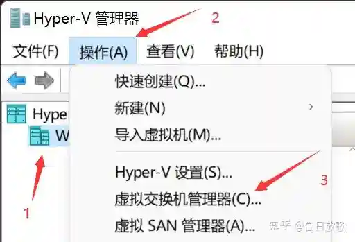
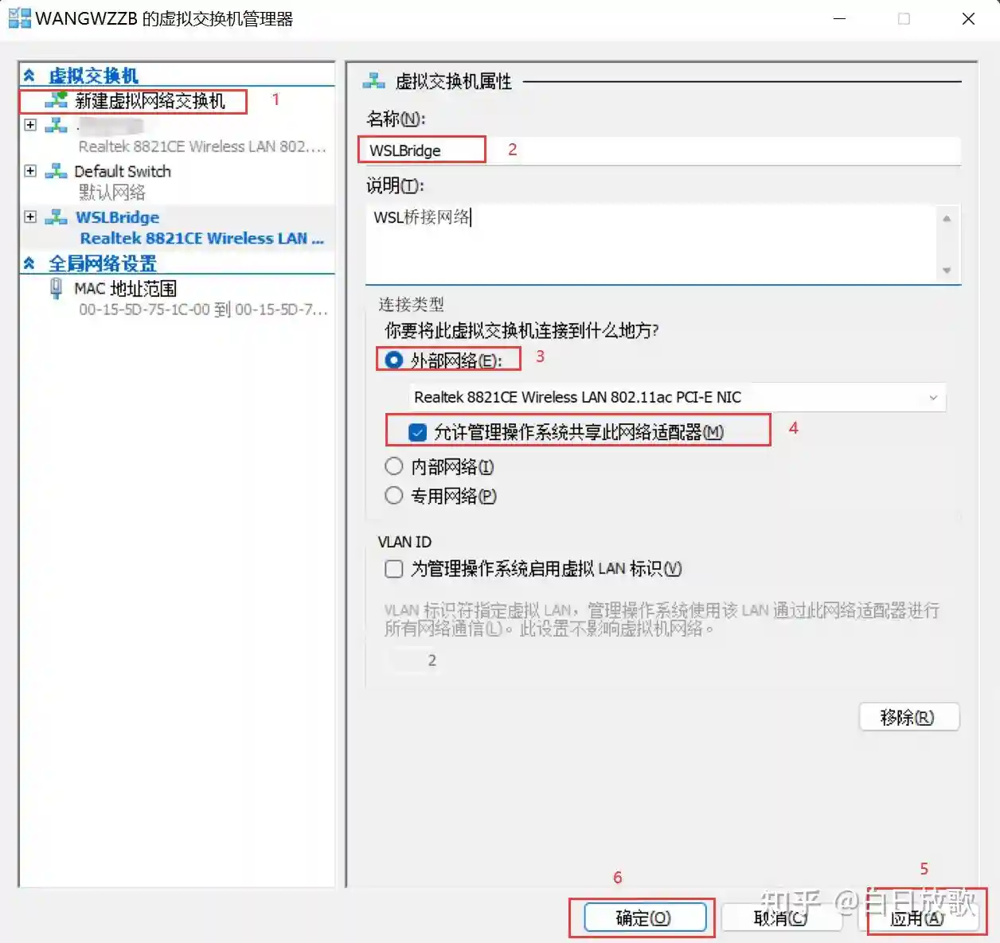

> 系统：windows11

## 一、wsl环境配置

### 1. 配置wsl+ubuntu环境

以管理员权限运行PowerShell，配置wsl环境

```bash
Enable-WindowsOptionalFeature -Online -FeatureName Microsoft-Windows-Subsystem-Linux

# 启用“虚拟机平台”可选组件 wsl2
Enable-WindowsOptionalFeature -Online -FeatureName VirtualMachinePlatform
```

在window store中安装```wsl(Windows Subsystem for Linux)```（新电脑中已安装）。

在window store中安装```ubuntu```后打开，并在弹出的bash上设置用户名和密码即可。

### 2. 和本机文件共享

**unbutn(wsl)访问windows**

在```/mnt/```路径下，可以访问到windows下的C盘、D盘等。

```bash
# wangbin @ wangbin in ~ [13:57:32]
$ ls /mnt
c  d  e
```

**windows访问unbutn(wsl)**

文件管理器主界面上有一个linux图标，通过这个路径，可以之间访问wsl中的文件

## 二、wsl环境问题

### **问题1**

虚拟化已经开启，wsl提示：WSL无法启动（虚拟化不能正常开启）

**解决：**

```bash
bcdedit /set hypervisorlaunchtype auto
```

### **问题2**

无法启动systemctrl和ssh（遇到过）

 System has not been booted with systemd as init system (PID 1). Can't operate

**解决**

在```/etc/wsl.conf```中添加如下内容，然后重启。

```bash
[boot]
systemd=true
```

### **问题3**

```bash
Installing, this may take a few minutes...
WslRegisterDistribution failed with error: 0x8007019e
Error: 0x8007019e ??????? Linux ? Windows ????

Press any key to continue...
```

**解决方案**

```bash
wsl --install
重启windows
```

## 三、wsl设置

### 1、命令

```bash
# 选择wsl版本
wsl --set-default-version 2
wsl --install Ubuntu

wsl --t Ubuntu-20.04
wsl --shutdown Ubuntu-20.04

# 导入和导出
wsl --export Ubuntu-22.04  C:\d\Ubuntu-22.04.tar
wsl --import Ubuntu-24.04 C:\my\wsl\Ubuntu-24.04 C:\Users\27226\Desktop\Ubuntu-24.04.tar
```

```bash
# ssh 开机自启
sudo systemctl enable ssh
```

### 2、wsl2设置代理

  [链接](./r02.network/05.使用代理.md)

### 3、wsl桥接设置

搜索```启用或关闭Windows功能```，勾选Hyper-V、适用于Linux的Windows系统 功能并重启电脑

搜索打开```Hyper-V管理器```


新增虚拟交换机



修改```~/.wslconfig```配置

```
[wsl2]
networkingMode=bridged
vmSwitch=WslBridge
ipv6=true
```

+ 重启wsl

```wsl --shutdown```后，重新打开wsl-ubuntu

### 4、wsl端口转发

  部署obsidian的时候，发现台式机没有Hyper-V管理器，桥接失败；于是尝试端口转发。  

  powershell 管理员权限打开，执行下面命令。  
  设置完成后，局域网其他设备可以通过物理机的ip，ssh到wsl中。

```bash
# 设置端口转发：Windows 22端口 → WSL 172.27.93.12:22
netsh interface portproxy add v4tov4 listenport=22 listenaddress=0.0.0.0 connectport=22 connectaddress=172.24.134.112

# 开放防火墙
New-NetFirewallRule -DisplayName "WSL_SSH" -Direction Inbound -Protocol TCP -LocalPort 22 -Action Allow

echo "端口转发设置完成！"
echo 
```

```bash
# 允许ping
netsh advfirewall firewall add rule name="Allow ICMPv4-In" protocol=icmpv4:any,any dir=in action=allow
```

## 四、图形化界面

+ 开箱即用的linux应用

  gedit等应用，安装后，在wsl中直接命令行打开即可

```bash
sudo apt install -y gedit gimp nautilus vlc x11-apps
```

+ 显示linux桌面

  使用xfce4和xLaunch显示linux桌面

```bash
sudo apt install -y xfce4

# 修改bashrc
echo "export DISPLAY=`cat /etc/resolv.conf |grep "nameserver" |cut -f 2 -d " "`:0" >> .bashrc

source .bashrc
```

下载[VcXsrv](https://sourceforge.net/projects/vcxsrv/)后，启动xLaunch

使用```startxfce4```命令启动桌面环境，xLaubch仍然是黑屏。（在ubuntu20.04和22.04上的尝试都失败了）

参考[Launch xfce4 or other desktop in Windows 11 WSLg Ubuntu distro](https://askubuntu.com/questions/1385703/launch-xfce4-or-other-desktop-in-windows-11-wslg-ubuntu-distro)，（在ubuntu20.04）使用如下脚本，可以显示桌面，但不可以复制粘贴等

```bash
#!/usr/bin/sh
Xwayland :1 &
xw_pid=$!
WAYLAND_DISPLAY= DISPLAY=:1 dbus-launch startxfce4
kill $xw_pid
```

## 五、移动wsl

```bash
# 导出wsl
wsl --export Ubuntu D:\wsl-backup\ubuntu.tar
wsl --unregister Ubuntu

# 导入wsl
wsl --import Ubuntu D:\wsl-distros\Ubuntu D:\wsl-backup\ubuntu.tar --version 2
wsl -d Ubuntu


# 修改默认用户
echo "[user]" | tee /etc/wsl.conf
echo "default=wangbin" | tee -a /etc/wsl.conf
```