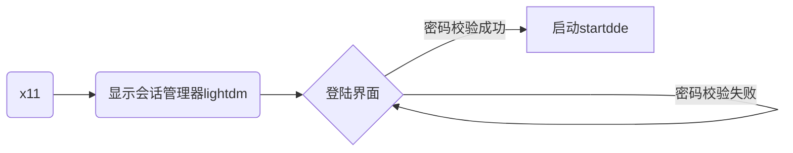

[TOC]

> deepin的系统不完全支持debian的标准，**使用Typora可以获得更好的阅读体验**。

## 1、deepin启动流程



### 1.1 x11启动显示管理器  

&emsp;&emsp;x11根据```/etc/X11/default-display-manager```中的内容选择显示管理器，比如lightdm、gdm3、KDM

### 1.2 lightdm启动登陆会话/界面

&emsp;&emsp;lightdm根据```/etc/lightdm/lightdm.conf```中的```greeter-session```，选择登陆会话，比如lightdm-deepin-greeter、lightdm-gtk-greeter

```bash
    cat /etc/lightdm/lightdm.conf |grep -v '#'
    greeter-session=lightdm-deepin-greeter      # greeter
    autologin-user=wangbin                      # 自动登陆
```

### 1.3 lightdm密码验证成功

&emsp;&emsp;```/usr/share/xsessions/deepin.desktop```中设置startdde作为新的会话。

&emsp;&emsp;lightdm session 启动后,如果存在 hostname 的变更,会导致 session 运行时变更请求验证信息, Xorg 验证失败，startdde重启。通过如下方法可以验证。

```bash
开机后进入tty界面，tty登录后
sudo hostnamectl set-hostname hhh
切换回登录界面
输入密码后，黑屏，重新显示登录界面
```

### 1.4 startdde和用户空间

&emsp;&emsp;startdde拉取dee-session-daemon，dde-session-daemon拉取dde-dock dde-desktop等dde（deepin desktop environment）组件。  
&emsp;&emsp;startdde启动的时候，运行autostart中的desktop文件。  
&emsp;&emsp;startdde维持一个watchdog。

## 2、开机自启

### 1. 添加/etc/init.d/中的rc.local

&emsp;&emsp;尝试失败
        
### 2. 写一个服务

&emsp;&emsp;[](https://blog.csdn.net/anjing6851/article/details/101466204)

### 3. 在rc中添加开机自启脚本

&emsp;&emsp;**验证成功**

+ 链接rc.local服务文件

```shell
sudo ln -fs /lib/systemd/system/rc-local.service /etc/systemd/system/rc-local.service
```

+ 创建脚本文件并添加内容

```shell
touch /etc/rc.local
chmod 755 rc.local

$ cat rc.local
#!/bin/bash
echo "test rc!!!" > /var/test_rc.log
```

## 3、登陆自启

### 3.1 方法1

&emsp;&emsp;在autostart中添加desktop文件。（标准协议支持）

### 3.2 

&emsp;&emsp;在/etc/profile.d/文件夹中添加脚本文件，/etc/profile会执行/etc/profile.d中的脚本。

&emsp;&emsp;1) 不需要+x权限  
&emsp;&emsp;2) 目录可以使用~，根目录也是~  
&emsp;&emsp;3) 最好不要启动窗口应用  
&emsp;&emsp;&emsp;&emsp;存疑，因为启动控制中心的时候，卡死了图形界面  
&emsp;&emsp;&emsp;&emsp;启动启动器，界面显示有点异常  
&emsp;&emsp;4) 脚本不是以sudo权限运行的


