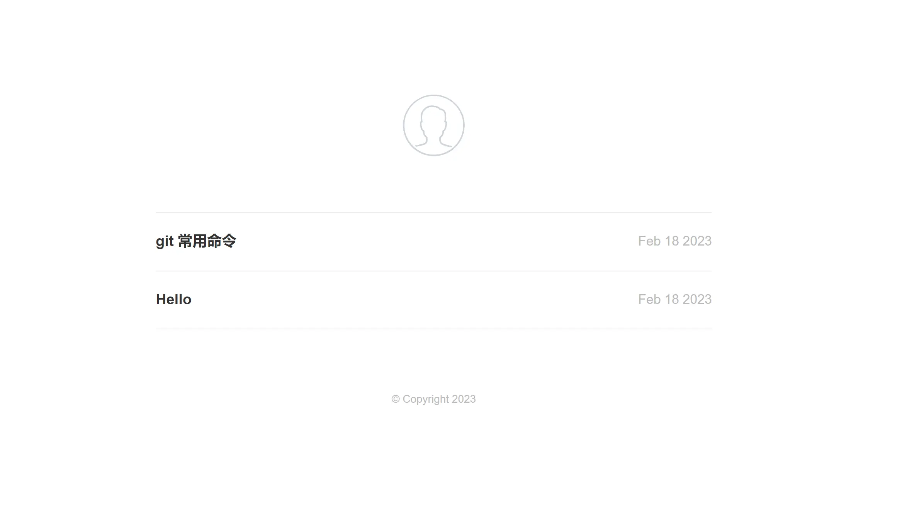
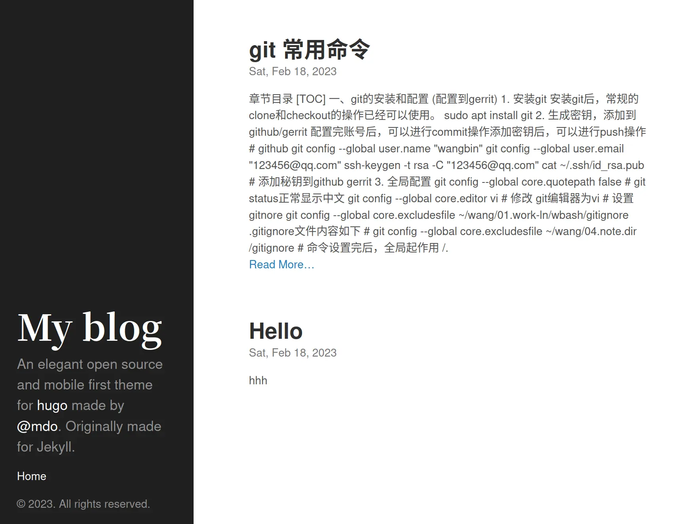
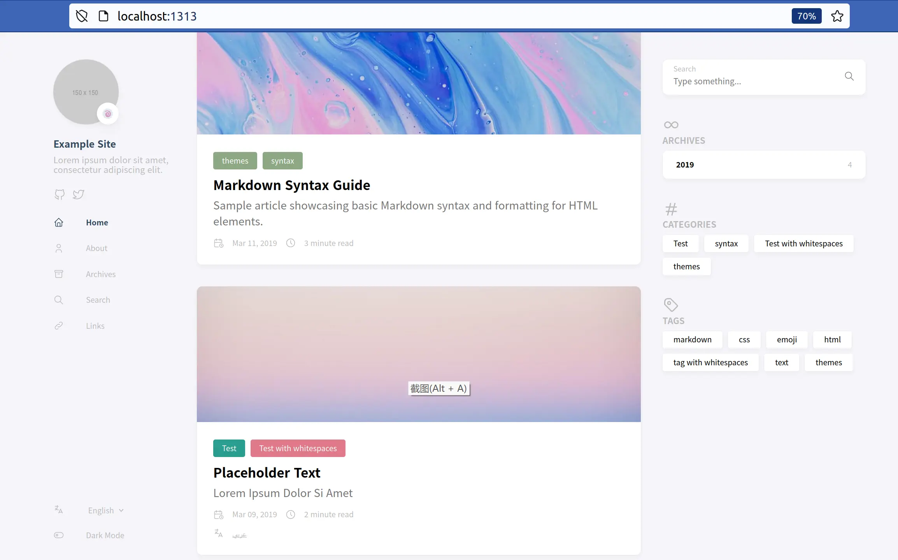

&emsp;&emsp;突然想弄一个blog网站玩一玩。  
&emsp;&emsp;最后选择了静态网站+github page的方式，简单实用。  
&emsp;&emsp;和hexo相比 hugo更好用，并且初始版本中没有太多的文件。

### 1. hugo环境搭建

```bash
sudo apt install hugo   # ubuntu源中的版本有点低，后来在官网中下载安装

hugo new site hugo-blog && cd hugo-blog
git clone git@github.com:digitalcraftsman/hugo-cactus-theme.git themes/cactus 

# 发布的blog文件在 hugo-blog/content/post文件夹中
hugo new post/hello-world.md

hugo server --theme=cactus --buildDrafts
```

&emsp;&emsp;然后```localhost:1313```就可以在浏览器中看到blog的首页。效果如下



### 2. 发布到github.io上

+ github page

&emsp;&emsp;在git上新建一个aaa.github.io的仓库，aaa是自己的用户名称。

&emsp;&emsp;如下图，仓库的设置界面设置将要发布的分支。后面的路径可以选择/和/doc，没有其它选项


+ 修改配置文件

&emsp;&emsp;config.toml配置文件修改如下

```bash
baseurl = "https://aaa.github.io"
title = "My blog"
theme = "cactus"
root = "/"
languageCode = "en-us"
```

&emsp;&emsp;发布public中的内容。

```bash
hugo

cd public && git init
remote add origin git@github.com:aaa/aaa.github.io.git

git add .
git commmit -m "tt"
git push origin main
```

&emsp;&emsp;然后在```https://aaa.github.io```上就可以看到效果了。

### 3. 其它主题

#### 3.1 hyde

&emsp;&emsp;hyde在本地运行的效果挺好的，但部署到github page后，主题失效。



#### 3.2 stack

+ 下载配置stack

```bash
git clone https://github.com/CaiJimmy/hugo-theme-stack/ themes/hugo-theme-stack
cp -r themes/hugo-theme-stack/exampleSite/* ./ && rm config.toml

hugo server
```

+ 解决报错

```bash
# 可以看到twitter超时报错
rm -rf content/post/rich-content

# 报错：ailed to transform "scss/style.scss" (text/x-scss)
# 需要安装 hugo extended
wget https://github.com/gohugoio/hugo/releases/download/v0.110.0/hugo_0.110.0_linux-amd64.deb
sudo dpkg -i *.deb
```

+ 效果

