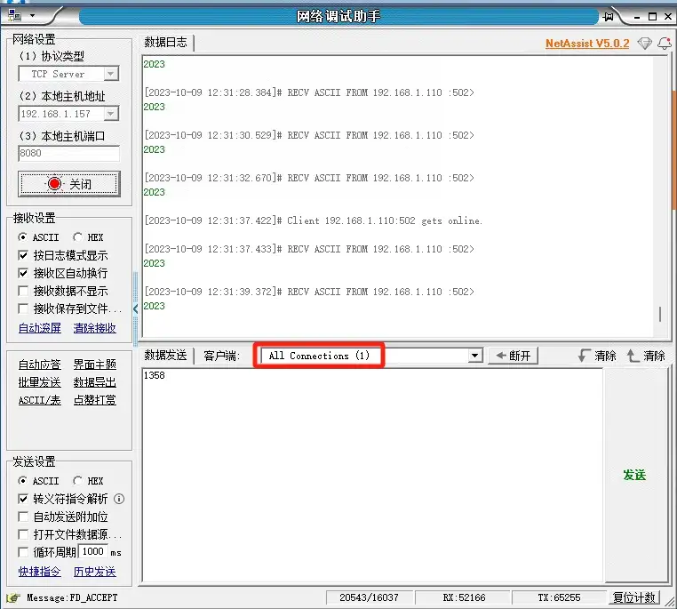
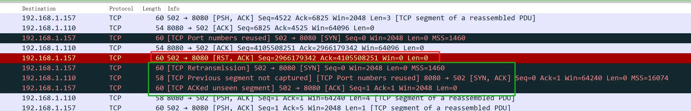

> 时间：2023.10.08
> 背景，机器运行过程中，下位机突然断开连接并创建了一个新的连接。
> 扯皮，说使用官方提供的网络调试助手没有问题，可能是我的问题。

### 网络调试助手

  仿照软件使用流程，编写初始化以及发送报文的流程。
  使用鼠标键盘事件操作网络调试助手，发送命令到下位机。

```python
import pyautogui
import time

# 发送一次命令
def send(cmd):
    pyautogui.hotkey('ctrl', 'a')
    pyautogui.typewrite(cmd)
    pyautogui.hotkey("enter")
    
if __name__ == '__main__':
    pyautogui.moveTo(200, 600, duration=1)
    pyautogui.click()
    
    time_inter = 0.1
    send("135610")
    time.sleep(10)
    send("1352405")
    time.sleep(time_inter)
    send("1350587")
    time.sleep(time_inter)
    send("1356100")
    time.sleep(time_inter)
    
    while True:
        send("13582")
        for i in  range(1, 10):
            send("1358")
            time.sleep(time_inter)
            send("1356")
            time.sleep(time_inter)
```

  脚本运行一段时间后，可以发现下面的连接个数由1变为了2

  

  即：看到机器运行过程中，突然发起了新的连接。但旧的连接并没有断掉。并且操作新的连接和旧的连接都可以发送命令。

### Wireshark

  有点奇怪，在我的服务端(qt5.8)中，是先收到断开连接的信号。然后收到新的连接(三次握手)。

  请教别人后，才想起来可以使用Wireshark抓包分析。

  安装后，使用```ip.addr == 192.168.1.110 and tcp```规则过滤。

  在网络调试助手连接个数由1变为2的时候，分析对应事件段的报文。

  

  可以看到：下位机客户端(192.168.1.110)给服务器发送了TCP连接重置（RST）信号。然后重新发起了tcp连接。

### 结论

  下位机重置连接后重新握手。我的上位机没问题，是断开连接后，收到了一个新的连接。
  网络调试的“状态”显示有bug。

  剩下的就是业务相关了，我是否可以判断网络是由于RST导致的断开连接，然后保存状态。