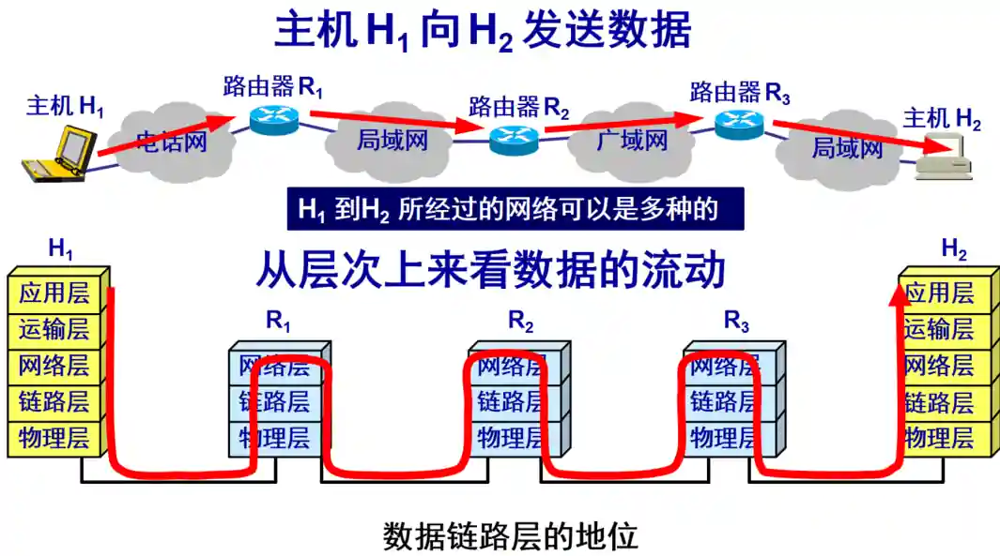

&emsp;&emsp;TCP协议部分可参考: [计算机网络复习笔记](https://hillzhang1999.gitee.io/2020/05/22/ji-suan-ji-wang-luo-quan-bu-fu-xi-bi-ji/#toc-heading-1)，写的真不错。

## 一、OSI网络分层以及各层对应的协议

 OSI七层模型 | TCP/IP四层模型       | 协议 |设备
---|---|---|--
应用层 <td rowspan="3"> 应用层      |http、ftp  |
表示层                              |JPEG、MPEG、ASII |
会话层                              | DNS、SSL |
传输层   | 传输层                   |TCP、UDP|网卡工作在传输层及其之上
网络层    | 网络层                  |IP（网际协议）、ICMP（网际控制消息协议）、ping  |路由器
数据链路层  <td rowspan="2">数据链路层 |Wi-Fi(IEEE 802.11)、MAC、PPP |网桥，交换机|
物理层                                  |RJ45、CLOCK、IEEE802.3 |网卡，网线，集线器，中继器，调制解调器|

+ 物理层

  提供原始的比特流传输。尽可能地屏蔽掉不同传输媒体和通信手段的差异。保证两台机器数据传输，其数据链路层获取到的数据是一致的。

+ 传输层：负责提供可靠的传输服务 

+ 网络层：负责网络间的寻址数据传输

  

## 二、网络层

&emsp;&emsp; 为互联网上任意两台主机提供分组交换（数据传输）服务。

  

  可以看到，路由器是互联网核心部分的最重要设备，但是不包含运输层和应用层，只负责以IP数据报（分组）的形式转发收到的分组。


## 三、运输层/传输层

&emsp;&emsp;运输层与网络层的区别在于：运输层为主机上的进程间提供数据传输服务，而网络层为主机提供分组传输服务。


### 1. TCP和UDP区别

|   | TCP  | UDP  |
| ------------ | ------------ | ------------ |
|   | 是面向连接的  | 是无连接的  |
|   | 数据可靠无差错但效率低  | 不一定可靠但传输效率高  |
|   |  一对一  | 一对一、一对多 |
|   |  基于流  | 基于报文 |

### 2.TCP

#### 1. 三次握手

|            | 我的理解 |                              |
|------------|----------|---------------------------------|
| 第一次握手 | 听得到吗 | 客户端发送syn包（syn=x）到服务器       |
| 第二次握手 | 听得到   | 服务器收到syn包，必须确认客户的SYN（ack=x+1），同时自己也发送一个SYN包（syn=y），即SYN+ACK包 |
| 第三次握手 | 好的     | 客户端收到服务器的SYN+ACK包，向服务器发送确认包ACK(ack=y+1）|

#### 2. 四次挥手

&emsp;&emsp;由于TCP连接是全双工的,断开一个TCP连接,需要客户端与服务器发送四个包来确认连接的断开。

+ 我的企业级理解

  1. 客：我这边结束了  
  2. 服：ok，（稍等，我释放一下资源）  
  3. 服：我这边也结束了  
  4. 客: 好的

#### 5.2 通过以下的几种方式保证数据的快速、可靠

+ 检验和：保证包中的数据没有出错

&emsp;&emsp;发送端按照特定算法计算出 TCP 报文段的检验和并存储在 TCP 首部中的对应字段上，接收端在接收时会以同样的方式计算校验和，如果不一致，说明报文段出现错误，会将其丢弃。

+ 序号与确认序号：对乱序的数据进行排序后发给应用层，并丢弃重复的数据。
  
+ 超时重传机制：当 TCP 发出一个报文段后，它会启动一个定时器，等待目的端确认收到这个报文段。如果不能及时收到一个确认，将重发这个报文段，后面会细讲这个机制。

+ 连接管理：也就是三次握手和四次挥手，连接的可靠性是整体可靠性的前提，本文第二部分将会详细介绍连接管理的内容。

+ 流量控制：TCP 双方都有固定大小的缓冲区，流量控制的原理是利用滑动窗口控制数据发送速度，避免缓冲区溢出导致数据丢失。

+ 滑动窗口和拥塞窗口

  滑动窗口和拥塞窗口是在解决两个正交的问题，只不过方法上都是在调整主机发送数据包的速率。 

#### 3. 连续ARQ协议——滑动窗口协议

&emsp;&emsp;滑动窗口协议就是一种连续ARQ协议，但它的内容比较详细。

&emsp;&emsp;发送方维持的发送窗口，位于发送窗口内的分组都可连续发送出去，而不需要等待对方的确认。  
&emsp;&emsp;这样，信道利用率就提高了，即提升两台主机之间的**传输速率**。（基础的ARQ协议，即停止等待协议，需要每发送一个分组就等待一次确认，效率很低）

#### 4. 拥塞窗口

&emsp;&emsp;拥塞窗口是解决**多主机**之间共享网络时出现的拥塞问题的一个修正。客观来说网络信道带宽不可能允许所有主机同时全速通信，所以如果全部主机都全速发送数据包，导致网络流量超过可用带宽，那么由于TCP的设计数据包会大量丢失，于是由于重传机制的触发会进一步加剧拥塞，潜在的导致网络不可用。

+ 拥塞窗口cwnd
  
  cwnd是发送方维护的一个的状态变量。发送窗口的值是swnd = min(cwnd, rwnd)，也就是拥塞窗口和接收窗口中的最小值。  

+ 慢启动门限ssthresh
  
  ssthresh （slow start threshold）状态变量。

```cpp
当cwnd < ssthresh，使用慢启动算法  
当cwnd > ssthresh，使用拥塞控制算法，停用慢启动算法  
当cwnd = ssthresh，这两个算法都可以
```

+ 拥塞控制：利用慢启动和拥塞避免等算法实现了拥塞控制。
  
  + 慢启动：当发送方每收到一个 ACK，拥塞窗口 cwnd 的大小就会加 1
  + 拥塞避免算法：  
&emsp;&emsp;超时重传时: ssthresh 设为 cwnd/2，cwnd 重置为 1，重新进入慢开始的状态。  
&emsp;&emsp;快速重传：如果收到3个重复ACK，可以认为网络情况还行，意外丢包。cwnd = cwnd/2 ，ssthresh = cwnd; 进入快恢复阶段

  + 快重传：接收方发现中间序列的某个包丢失，则在收到之后的包的时候，发送收到的之前包的ack，连续三次冗余
  + 快恢复：慢开始门限sstresh和拥塞窗口cwnd都设置为当前拥塞窗口的一半，然后执行拥塞避免算法

### 3. 一次kcp日志分析

```bash
session=53501 [QOS] reason=11, srtt=40, min/avg/max=0/53/101, windows=4/0, block_tm=15, throughput=1476448
```

reason=11  表示触发这次 QoS 更新的原因是“检测到突发延迟”或“延迟波动异常”；通常是网络短时抖动或变化  
           16 代表比较严重的网络异常

srtt=40, min/avg/max=0/53/101
平滑往返延迟（单位：ms）为 40ms，说明连接当前延迟较低，网络尚可。后面是 rtt的值（ms）

windows=4/0  发送窗口和接收窗口大小：

block_tm=15  当前阻塞时间 15ms，基本可以忽略（通常 >100ms 才需要关注）

throughput=1476448 | 吞吐量为约 1.4MB/s（约11.8 Mbps），属中等偏高水平

```bash
session=53501 receive=15 re_receive=0
```

receive=15 表示接收到了15个新的、有效的数据单元
re_receive=0 说明没有出现重复数据接收，网络传输比较稳定，没有重传情况

```bash
session=53501 rtt=35 srtt=44 rto=190 cwnd=51 incr=26144 ssthresh=800 nsend=19 nresend=0 nfastresend=0 nsent=19 maxxmit=1
```

rto=190 指的是 重传超时时间（Retransmission Timeout）为190毫秒

cwnd=51 incr=26144  拥塞窗口相关

nsend = 19 当前已经发送了19个包
nresend    普通超时重传次数
nresend    快速重传次数

```bash
session=53501 [NC-LOST] maxlostrto=1000 sn=48 ssthresh=35->27 cwnd=35->27
```

[NC-LOST] 表示网络丢包事件  
ssthresh 和 cwnd 持续下降，代表丢包压力变大
 
## 四、其他
 
### 1. 字节序

+ 大端序与小端序

&emsp;&emsp;小端序：数据低位对应存储低位，一般存在操作系统
&emsp;&emsp;大段序一般用在网络通信，网络字节序都是大端字节序。

+ 主机字节序和网络字节序的转换

从socket读出后要转化为主机字节序，然后再处理。  
主机字节序到网络字节序  
&emsp;&emsp;u_long htonl (u_long hostlong);  IP  
&emsp;&emsp;u_short htons (u_short short);  port  
网络字节序到主机字节序  
&emsp;&emsp;u_long ntohl (u_long hostlong);  
&emsp;&emsp;u_short ntohs (u_short short);

### 2. 重定向和转发的区别

&emsp;&emsp;重定向：你先去了A局，A局的人说：“这个事不归我管，去B局”，然后，你就从A退了出来，自己乘车去了B局  
&emsp;&emsp;转发：你先去了A局，A局的人看了以后，知道这个事其实应该B局来管，但是他没有把你退出来，而是让你坐一会儿，自己到后面办公室联系了B的人，让他们办好以后，送了过来。
