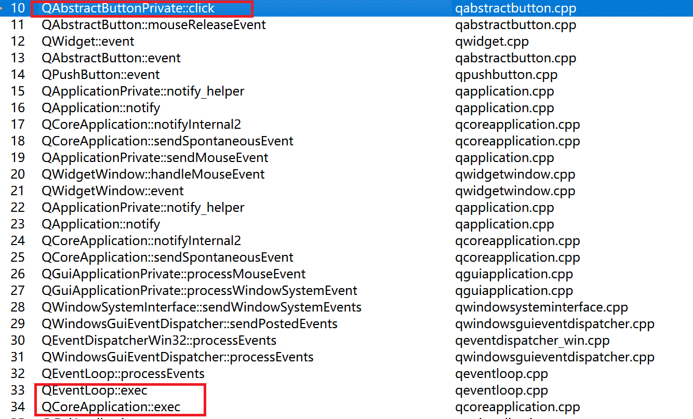
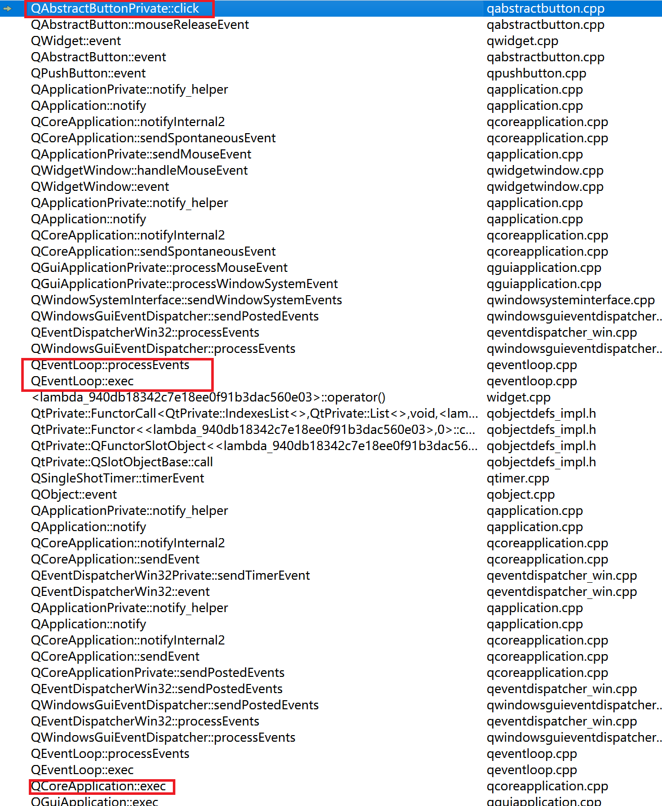

## 一、事件处理

### 1. 事件的来源

+ 系统消息

  系统内核上报的消息，比如鼠标、键盘事件等。

+ Qt应用程序

  Qt框架产生的事件，比如paintEvent、QTimer::timeout等。  
  此处也可以分为两种：

  - postEvent()

    postEvent()会将事件**放入Qt的消息队列中，等待依次被处理**。比如QWidget::update。

  - sendEvent()
  
    事件不会放入队列, 而是直接被派发和处理。比如QWidget::repaint  
    QApplication::sendEvent()是通过调用QApplication::notify(), 直接进入了事件的派发和处理环节。

&emsp;&emsp;当发送事件的对象和接收事件的对象位于同一线程时，sendEvent是**同步**（阻塞）的；当发送者和接收者处于不同线程的时候，sendEvent是**异步**的。   
&emsp;&emsp;postEvent**总是异步的**。

### 2. 事件的派发和过滤

#### 2.1 多种事件过滤

- 重写QApplication::notify()
  
- qApp上安装过滤器
  
  ```qApp->installEventFilter(pA);```，将事件转为A的eventFilter函数处理。如果eventFilter返回false，事件进一步下发；返回true，则代表事件处理完成。

- 给具体的对象安装过滤器

  ```pB->installEventFilter(pA);```有发往B的事件都将先由A的eventFilter()处理，需要重写A的```eventFilter```

- 重写event函数

- 重写特定事件函数

  mousePressEvent(), keyPressEvent(), paintEvent() 等

#### 2.2 事件的转发

&emsp;&emsp;对于某些类别的事件,如果在整个事件的派发过程结束后还没有被处理, 那么这个事件将会向上转发给它的父widget, 直到最顶层窗口。  

#### 2.3 事件的处理

&emsp;&emsp;Qt中和事件相关的函数通过两种方式相互通信。  
&emsp;&emsp;一种是QApplication::notify(), QObject::eventFilter(), QObject::event()通过返回bool值来表示是否已处理。  
&emsp;&emsp;另一种是调用QEvent::ignore() 或 QEvent::accept() 对事件进行标识，accept表示事件已经被当前对象处理，不需要再传递给其他对象处理。

```cpp
// 调用父类的QWidget::mousePressEvent函数是没有意义的，
// 因为e->accept()以及接受了这个事件，并且不希望其他对象继续处理它。
void Widget::mousePressEvent(QMouseEvent *e) {
    e->accept();
    return QWidget::mousePressEvent(e);
}
```

### 3. win32和qt窗口消息的对比

&emsp;&emsp;通常写win32程序，鼠标消息应该是直接发给指定窗口句柄的，指定窗口没有处理就会转化成透传消息，交给父窗口处理。你在一个普通文字label上点击，父窗口也能收到鼠标事件。 

&emsp;&emsp;Qt是所有消息都发给了顶层窗口，所以事件分发逻辑是自己处理，主窗口收到鼠标事件然后Qt自己分发给指定子控件，QEvent会有ignore或者accept表示自己处理了没有。  
&emsp;&emsp;例如鼠标点击事件，事件分发器发现没有被处理，然后数据分发给父窗口。

## 二、事件循环

&emsp;&emsp;事件机制（QEventLoop）是qt的核心机制之一。  
&emsp;&emsp;信号槽也依赖于此项特性；QTimer的也是在事件循环的时候被触发等。 

&emsp;&emsp;每个线程都拥有属于自己的事件循环。

### 1. Qt框架内部对事件循环的调用

&emsp;&emsp;```QApplication::exec()```、```QDialog::exec()```、```QMessageBox::exec()```内部都有如下的代码。

```cpp
QEventLoop eventLoop;
eventLoop.exec();
```
```cpp
int QEventLoop::exec(ProcessEventsFlags flags){
    ...
    while (!d->exit.loadAcquire())
        processEvents(flags | WaitForMoreEvents | EventLoopExec);
}
```

&emsp;&emsp;通过```QEventLoop::exec()```启用事件循环，exec内部维持了一个while循环。不停的接受来自系统或者程序内部的事件，并进行分发处理。

### 2. 事件循环嵌套

&emsp;&emsp;问题来了，一个线程中，有且只有一个事件循环。  
&emsp;&emsp;那么我们在主线程中是如何调用```QDialog::exec```、```QEventLoop::exec```的时候发生了什么？重新启用一个事件循环？但一个线程是不可能同时执行两个while(1)的。

&emsp;&emsp;首先，每个```QEventLoop::exec```都可以从系统或软件中接受处理信号。  
&emsp;&emsp;然后，执行到exec，当前函数就阻塞住了。  
&emsp;&emsp;可以理解为，由一个while(1)进入了另外的一个while(1)。但功能一致，处理事件，所以程序可以正常运行。

+ 例子

  界面正常显示后，点击界面，函数的调用堆栈如下：
    

  如果在程序中加入如下代码，1s后，点击界面，调用堆栈如下：
  ```cpp
  QTimer::singleShot(1000, this, []{
      QEventLoop loop;
      loop.exec();
  });
  ```
    

### 3. QEventLoop主要代码

```cpp
int QEventLoop::exec(ProcessEventsFlags flags) {
    while (!d->exit.loadAcquire())
        processEvents(flags | WaitForMoreEvents | EventLoopExec);
}

bool QEventLoop::processEvents(ProcessEventsFlags flags)
{
    Q_D(QEventLoop);
    auto threadData = d->threadData.loadRelaxed();
    if (!threadData->hasEventDispatcher())
        return false;
    return threadData->eventDispatcher.loadRelaxed()->processEvents(flags);
}

// QCoreApplication::processEvents();也调用了下面这个函数，这就是其可以在耗时操作中刷新界面的原因
bool QWindowsGuiEventDispatcher::processEvents(QEventLoop::ProcessEventsFlags flags)
{
    const QEventLoop::ProcessEventsFlags oldFlags = m_flags;
    m_flags = flags;
    const bool rc = QEventDispatcherWin32::processEvents(flags);
    m_flags = oldFlags;
    return rc;
}

bool QEventDispatcherWin32::processEvents(QEventLoop::ProcessEventsFlags flags){
    // 核心代码 TODO
}
```

