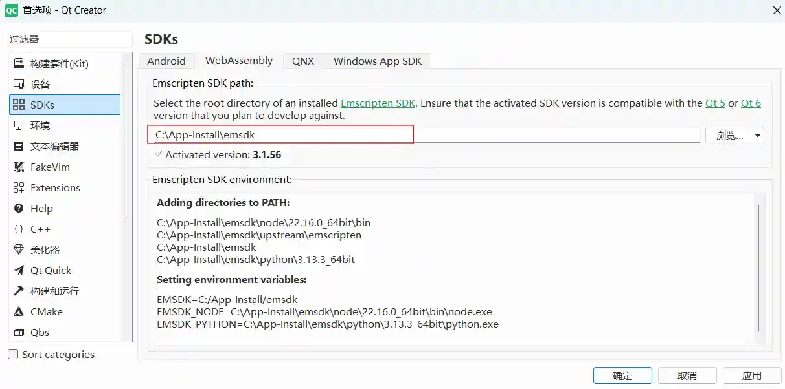
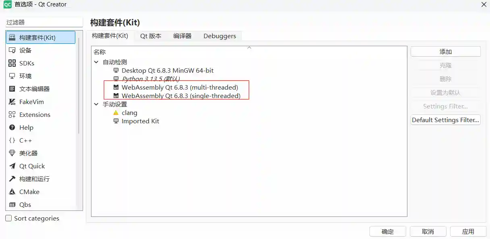

### Qt + WebAssembly 配置

参考 [链接](https://doc.qt.io/qt-6/wasm.html)

#### Windows

qt6.9 -> 3.1.70 （这个版本异常）  
qt6.8 -> 3.1.56

+ 配置emsdk

```bash
git clone https://github.com/emscripten-core/emsdk.git
cd emsdk
./emsdk install 3.1.56
./emsdk activate 3.1.56   
./emsdk_env.bat
```

+ 配置qt

> 我的qt是卸载后，重新安装并且选择了WebAssembly模块

首选项 -> SDKs ->WebAssembly 中修改root dir 为刚刚下载编译的路径。



然后，构建套件可用



在新建项目的时候，可以选择msvc、mingw或则webassembly了

Ctrl + R, 自动启动server，并且在浏览器中运行程序