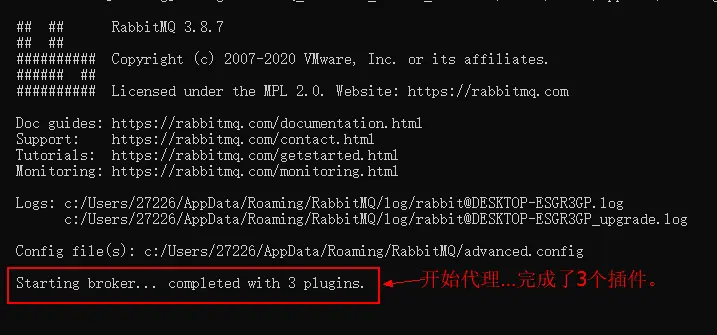
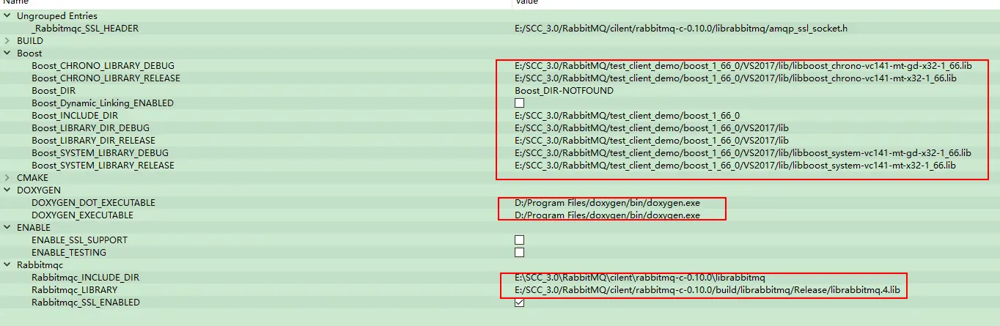
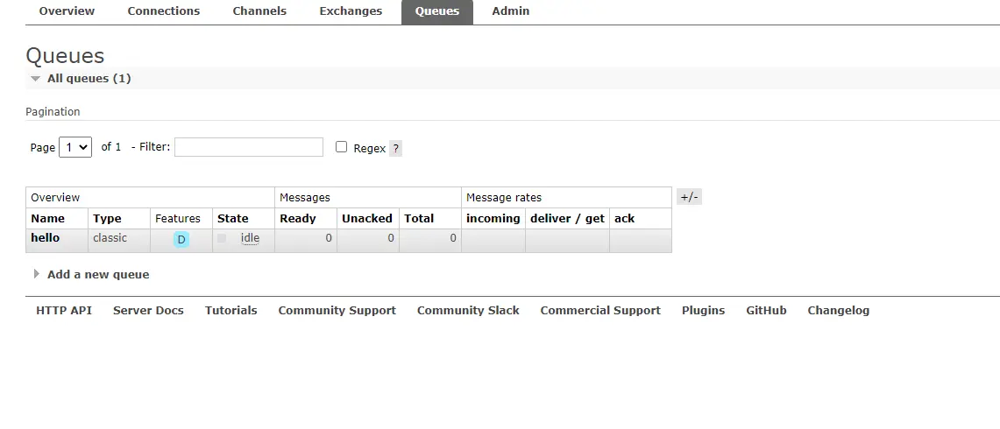
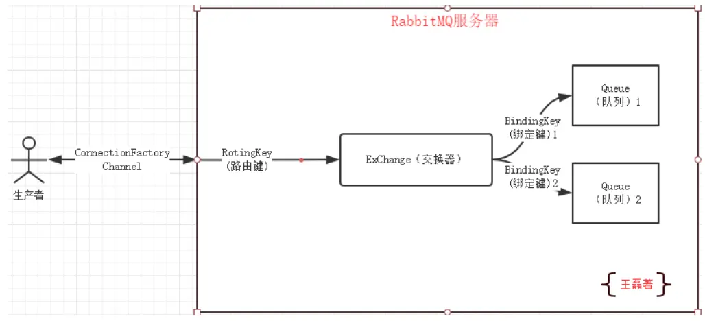
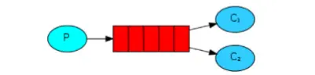

## 一、编译并测试

### 1、安装服务端

1) 下载安装Erlang（otp_win32_23.0.exe）  
  新建系统变量：变量名 ERLANG_HOME 变量值 D:\Program Files (x86)\erl-23.0（Erlang安装目录）  
  添加到PATH：%ERLANG_HOME%\bin;

2) 下载安装rabbitmq-server-3.8.7.exe  
  新建系统变量：变量名 RABBITMQ_SERVER 变量值 D:\Program Files\RabbitMQ Server\rabbitmq_server-3.8.7（RabbitMQ Server安装目录）  
  添加到PATH：%RABBITMQ_SERVER%\sbin;

3) 一些rabitmq的命令：打开cmd，进入安装目录的sbin目录。  
```bash  
rabbitmq-plugins enable rabbitmq_management
rabbitmq-plugins disable rabbitmq_management
rabbitmq-plugins start
```

### 2、启动服务

&emsp;&emsp;通过cmd 运行services.msc打开服务，可以看到里面有一个RabbitMQ服务，设置为手动启动，然后再运行rabbitmq-server.bat  

&emsp;&emsp;cmd查看端口的使用情况  netstat -nao|findstr "25672"  
&emsp;&emsp;启动服务：rabbitmq-server start


&emsp;&emsp;打开 `http://127.0.0.1:15672/` 用户名和密码：guest  

### 3、cmake编译rabbitmq-c（rabbitmq-c-0.10.0）

&emsp;&emsp;重点：取消勾选ENABLE_SSL_SUPPORT,依次按下configure->generate->open project  
&emsp;&emsp;打开vs编译

### 4、cmake编译boost

~~使用安装版的boost（失败，cmake的参数总是填写不好）  
下载boost源码  
    执行bootstrap.bat    error: 此时不应有 \erl-23.0\bin。  
    卸载服务端安装的2个软件。（执行bootstrap.bat，ok）。然后装回去（目录不可以有空格，不知道什么鬼，为什么会影响到这里）~~

+ 解压boost源码  
+ 执行bootstrap.bat后，执行  
```bash
b2.exe --build-type=complete --build-dir=build toolset=msvc-14.1 address-model=32 stage --stagedir="./VS2017"  
b2.exe --build-type=complete --build-dir=build toolset=msvc-14.1 address-model=32 install
```

### 5、cmake-gui编译SimpleAmqpClient

- 注意Boost要求的CMake版本。  
- 安装doxygen-1.8.19-setup.exe

- cmake-gui中编译rabbitmq，添加boost和doxygen等环境变量，要有如下的修改：



  注意enabele。

### 6、mqTest（测试simpleAmqpClient）

```cpp
#include <SimpleAmqpClient/SimpleAmqpClient.h>
#include <iostream>
int main() {
  std::string queue_name = "hello";

  AmqpClient::Channel::ptr_t channel = AmqpClient::Channel::Create("localhost");
  //创建channel

  channel->DeclareQueue(queue_name, false, true, false, false);
  //创建队列，第一个参数为队列名称，其余后续会提到。

  std::string message;
  std::cin >> message;

  channel->BasicPublish("", queue_name,
                        AmqpClient::BasicMessage::Create(message));
  //第一个是exchange名称，第二个参数是routing_key（此处可理解为消息会被送往的队列）。

  qDebug() << "[x] send " << QString::fromStdString(message);
}
```


## 二、rabbitmq工作原理

[深入了解RabbitMQ工作原理及简单使用](https://www.cnblogs.com/vipstone/p/9275256.html)

###  Rabbit名词。

+ ConnectionFactory（连接管理器）：应用程序与Rabbit之间建立连接的管理器，程序代码中使用；  
+ Channel（信道）：消息推送使用的通道；  
+ Exchange（交换器）：用于接受、分配消息；  
+ Queue（队列）：用于存储生产者的消息；  
+ RoutingKey（路由键）：用于把生成者的数据分配到交换器上；  
+ BindingKey（绑定键）：用于把交换器的消息绑定到队列上；

看到上面的解释，最难理解的路由键和绑定键了，那么他们具体怎么发挥作用的，请看下图：



[RabbitMQ交换器Exchange介绍与实践](https://www.cnblogs.com/vipstone/p/9295625.html)


### SimpleAmqpClient

&emsp;&emsp;SimpleAmqpClient是一个封装了rabbitmq的c++库。

#### 工作模式

1、work queues  
    <div align=center>
         
    </div>
&emsp;&emsp;默认情况下，rabbitmq会将生产者的每个消息依次分发给各个消费者，比如有3个消费者(c1,c2,c3)，生产者将8条消息(msg1,msg2…msg8)分发出去，那么消费者c1将得到消息msg1,msg4,msg7；消费者c2将得到msg2,msg5,msg8；消费者将得到msg3,msg6。这就是所谓的轮询分发。  
&emsp;&emsp;不需要交换机

2、Publish/Subscribe  
&emsp;&emsp;一个消息发了以后，让所有消费者都可以接收到。  
&emsp;&emsp;和上一个模式相比，增加了队列和交换机的绑定

3、Routing

4、Topics

5、Header

6、RPC