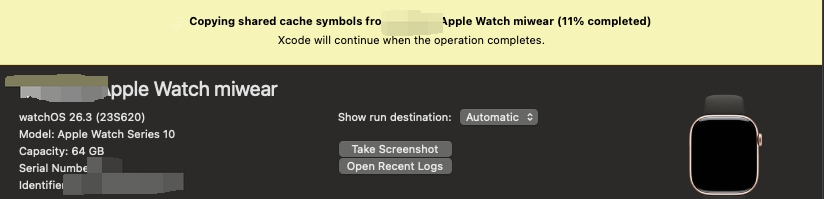

## xcode连接iwatch （watch开发）

> Disconnectd无法变为Connected，参考 [apple watch真机开发第一步连接xcode详细教程](https://juejin.cn/post/7381999273355231282)

### 第一次使用xcode连接aw

20:00

设备列表中，有iphone，没有iwatch。（iphone列表的Open Console中可以看到iwatch）

22:00

折腾了半天，**iphone上的watch app保持在前台**，下一次的xcode重新配对，iwatch中弹出了弹框，然后左侧设备列表中有了iwatch设备。
iwatch中打开开发者。

iwatch戴在手上，保持常量，还是无法由 Disconnected变为 Connected。

22:30

iwatch取消配对，手机取消配对（重新配对两三次后，iwatch开始自己连接）。成功的曙光好像来了。
等了二十多分钟，终于连上了

**备注**

1. **xcode的版本可以和手机/watch 不一致**  
2. **办公网络有时候有问题**，xcode无法连接watch或者连上后，很容易断开 

### 2026.05.14

  测试同学有几次device界面无法发现watch。  
  **iphone上watch应用显示到前台**，然后就可以了。

### 2026.05.15

  重新拿到手表，死活连接不上（重启、重新打开开发者等等都试过了）。  
  删除xcode缓存，然后device界面就再也发现不了手表了。

  现在猜测是电量太低的原因 （10%的电量）

  最后是电量问题，**充电30%后，重新走一遍流程ok**

### 2026.06.16

  昨天又又又又遇到xcode连不上aw的问题了。  
  折腾了一天，今天突发奇想，更新一下aw系统（手机是26.5的系统，aw还是26.x）。  
  **aw系统升级后（和iphone同一个版本）连上了**。emmm