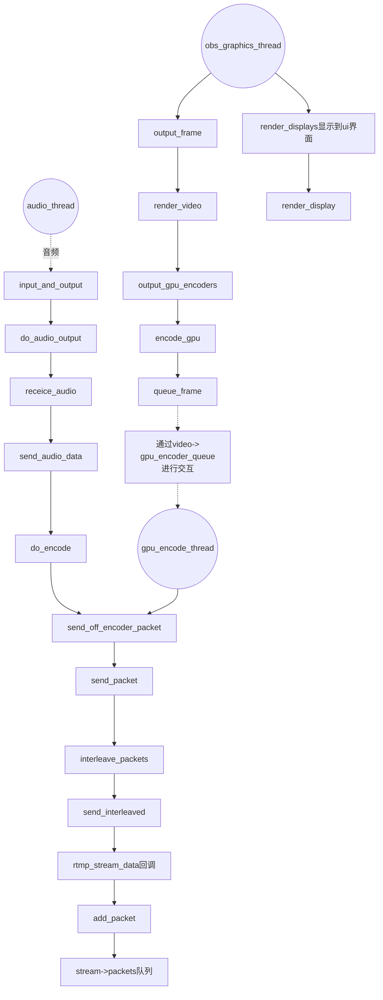

h264包含音频吗

obs-studio 流的入口


> 看代码两天，这么大的工程，看个寂寞

代码版本: 27.0.1

### 1. log

  GenerateTimeDateFilename() 设置日志文件     %d-%02d-%02d

  base_set_log_handler()     设置日志处理函数

### 2. libobs

  通过pthread_create创建了如下线程：
  
+ audio_thread （音频编码/混音？）
+ video_thread （视频编码）

+ gpu_encode_thread         （GPU编码）
+ obs_graphics_thread       （视频渲染）

  obs_graphics_thread_loop

+ end_data_capture_thread   （结束推流线程）
+ reconnect_thread          （推流掉线重连）
+ obs_hotkey_thread

```cpp
struct obs_core {
	...
	struct obs_core_video video;
}

struct obs_core_video {
    // 主画布 渲染当前场景下sources的画布 
    // 渲染主窗口的窗口时 直接把这个纹理贴到display中
	gs_texture_t *render_texture;

    // output画布 如果直播录像时的宽高（output宽高）和主画布宽高不一样，
    // 需要在该画布上对render_texture做缩放
	gs_texture_t *output_texture;

    // 做GPU转换时 用来保存各个分量的画布 不可读
    // 做转换的纹理 就是render_texture或output_texture
	gs_texture_t *convert_textures[NUM_CHANNELS];
};

struct obs_core_video{
	struct circlebuf gpu_encoder_queue;
	struct circlebuf gpu_encoder_avail_queue;
}

```

---

+ 参考[OBS源码分析](https://blog.csdn.net/yao_hou/category_11128777.html)

调试后发现的流程如下：

无论是拉取rtmp后转发，还是采集本地数据后推送，都走了如下的流程。



+ video->gpu_encoder_avail_queue 这是干嘛的？

```cpp
obs_graphics_thread->queue_frame() {
	pop		video->gpu_encoder_avail_queue
	push 	video->gpu_encoder_queue
}

gpu_encode_thread {
	pop		video->gpu_encoder_queue
	send_off_encoder_packet (发送数据)
	push  	video->gpu_encoder_avail_queu
}

```

+ 参考[OBS架构分析](https://zhuanlan.zhihu.com/p/537921063)
