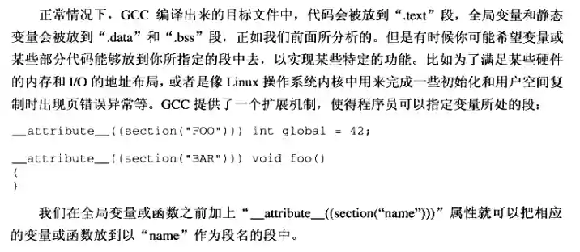
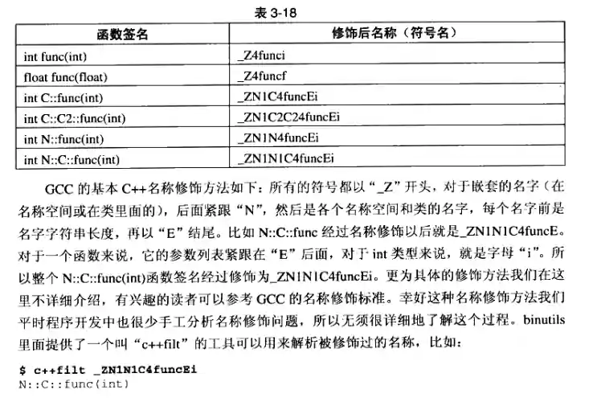

[程序员的自我修养：链接、装载与库](https://awesome-programming-books.github.io/others/%E7%A8%8B%E5%BA%8F%E5%91%98%E7%9A%84%E8%87%AA%E6%88%91%E4%BF%AE%E5%85%BB%EF%BC%9A%E9%93%BE%E6%8E%A5%E3%80%81%E8%A3%85%E8%BD%BD%E4%B8%8E%E5%BA%93.pdf)

## 一、

  进程 时间片
  线程  
  window or linux  
    高优的while会让低优线程得不到执行？？

  多对多线程模型？

## 二、静态链接

### 2.1 被隐藏了的过程

预处理（Preprocessing）：

预处理主要处理源代码文件中的预处理指令，这些指令以 # 开头。
它负责包含头文件（#include）、宏定义的展开（#define）、条件编译指令（#ifdef、#ifndef、#endif 等）以及其他预处理指令。
预处理不涉及语法检查或代码执行，它仅仅对源代码进行文本层面的转换。
结果通常是一个新的源代码文件，其中已经包含了所有必要的头文件内容，并且宏定义已经展开。
编译（Compilation）：

编译阶段是将预处理后的源代码转换成汇编语言代码。
编译器会进行语法检查、语义分析、优化以及代码生成等操作。
编译器会将高级语言（如 C、C++）转换成低级语言，通常是平台相关的汇编语言。
编译的结果是一个或多个汇编语言文件（.asm、.s 等），这些文件包含了源代码对应的机器级指令。
汇编（Assembly）：

汇编阶段是将汇编语言代码转换成机器码。
汇编器（Assembler）读取汇编语言文件，并将其转换成机器码，生成目标文件（.o、.obj 等）。
目标文件包含了可重定位的机器代码，它们还包含了符号表（symbols），这些符号用于链接阶段解决外部引用。
链接（Linking）：

链接阶段是将一个或多个目标文件，以及它们依赖的库文件链接在一起，生成最终的可执行文件。
链接器（Linker）负责解析不同目标文件中的符号引用，将它们正确地组合在一起。
链接器还会处理库文件中的函数调用和全局变量，确保所有的函数和变量都被正确地解析和定位。
最终，链接器生成一个单一的可执行文件，这个文件可以直接在操作系统上运行。

### 2.2 编译器做了什么

编译过程可分为6步：扫描、语法分析、语义分析、源代码优化、代码生成和目标代码优化

链接：从原理上来讲，他的工作无非就是把一些指令对其他符号地址的引用加以修正。链接过程主要包包括了地址和空间分配、符号决议和重定位等这些步骤

## 三、目标文件里有什么

### 3.1 目标文件格式 

windows下的PE和linux的ELF，都是COFF格式的变种。

 

| ELF文件类型  | 实例   |
| -------  | --- |
|  可重定位文件    | linux的.o  windows的.obj   |
| 可执行文件 |  |
| 共享目标文件| 动态库，so和dll |
| dump文件 | |

### 3.2 目标文件是什么样子

+ FileHeader即ELF文件头
  文件属性，段表等
+ .code代码段（ .text）
+ .data数据段
+ .bss
  未初始化的全局变量

#### 3.3.4 其他段

+ .rodata   只读数据段
+ .comment  编译器版本信息
+ .debug
+ .dynamic  动态链接信息
+ .hash     符号哈希表
+ .line     调试时的行号表，即源代码行号和编译后指令的对应表
+ .note     额外的编译器信息，比如公司名、程序版本号等
+ .strtab
+ .symtab
+ .shstrtab
+ .plt 和 .got    动态链接的跳转表和全局入口表
+ .init 和 .fini  程序初始化于总结代码段

以'.'开头的这些段是系统保留的。  
应用程序可以使用非系统保留的名字作为段名
**objcopy工具**可以插入图片等作为目标文件中的一个段

**自定义段**

### 3.4 ELF文件结构描述

#### 3.4.2 段表

### 3.5 链接的接口，符号

在链接中，目标文件之间相互拼合实际上是目标文件之间对地址的引用，即对函数和变量的地址的引用。

符号是链接中的粘合剂，整个连接过程中正是**基于符号才能够正确完成**。

#### 3.5.3 符号修饰和函数签名

**c++filt工具**可以解析被修饰过的名称

不同编译器采用各不同的名字修饰方法，必然会导致不同编译器产生的目标文件无法正常互相链接，只是导致不同编译器之间不能互相操作的主要原因之一。  
**C++ABI和COM**会讨论这个问题

#### 3.5.5 弱符号与强符号

## 四、静态链接

.bss在目标文件和可执行文件中并不占用空间，但它在装载时占用地址空间。

“链接器为目标文件分配地址和空间”这句话中的“地址和空间”有两个含义：
1. 输出的可执行文件中的空间
2. 装载后的内存中的虚拟地址空间

事实上，我们这里谈到的空间分配只关注于虚拟地址空间的分配，因为这个关系到连接器后面的关于地址计算的步骤，而可执行文件本身的空间分配和链接过程关系不是很大

### 4.4 C++相关问题

#### 4.4.1 重复代码消除

-ffunction-sections和fdata-sections编译选项

#### 4.4.2 全局构造与析构

全局变量的构造和析构在分别在main函数的执行前和执行后执行。

+ .init

保存的是可执行指令，构成了进程的初始化代码。在main函数被调用之前，glibc的初始化部分安排执行这个段中的代码

+ .fini

保存着进程种植代码指令，当一个程序的main函数正常退出时，glibc会执行这个段中的代码

#### 4.4.3 C++与ABI

如果要使两个编译器编译的目标文件能够相互链接，那么目标文件必须满足如下条件：采用相同的目标文件格式、拥有相同的符号修饰标准、变量的内存分布相同、函数的调用方式相同，等等。  
其中我们把符号修饰标准、变量内存布局、函数调用方式等这些跟可执行代码二进制兼容性相关的内容称为ABI（Application Binary Interface）

### 4.5 静态库链接

### 4.6 链接过程控制

#### 4.6.1 链接控制脚本

#### 4.6.2 最“小”程序

### 4.7 BFD库

---
第3部分：装载与动态链接
---

## 六、可执行文件的装载与进程

### 6.1 进程虚拟地址空间

32位系统最大支持4GB的内存地址

### 6.2 装载的方式

#### 6.2.1 覆盖装入

古老的方法  
有点像嵌入式中驱动的装载？？  

#### 6.2.2 页映射

### 6.3 从操作系统角度看可执行文件的装载
