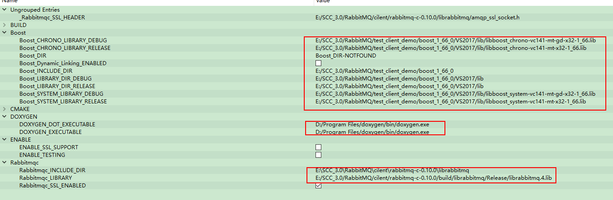

### 一、安装服务端

1、下载安装Erlang（otp_win32_23.0.exe）  
&emsp;&emsp;新建系统变量：变量名 ERLANG_HOME 变量值 D:\Program Files (x86)\erl-23.0（Erlang安装目录）  
&emsp;&emsp;添加到PATH：%ERLANG_HOME%\bin;

2、下载安装rabbitmq-server-3.8.7.exe  
&emsp;&emsp;新建系统变量：变量名 RABBITMQ_SERVER 变量值 D:\Program Files\RabbitMQ Server\rabbitmq_server-3.8.7（RabbitMQ Server安装目录）  
&emsp;&emsp;添加到PATH：%RABBITMQ_SERVER%\sbin;

3、一些rabitmq的命令：打开cmd，进入安装目录的sbin目录。    
&emsp;&emsp;> rabbitmq-plugins enable rabbitmq_management  
&emsp;&emsp;> rabbitmq-plugins disable rabbitmq_management  
&emsp;&emsp;> rabbitmq-plugins start

### 二、启动服务

&emsp;&emsp;通过cmd 运行services.msc打开服务，可以看到里面有一个RabbitMQ服务，设置为手动启动，然后再运行rabbitmq-server.bat  
&emsp;&emsp;cmd查看端口的使用情况  netstat -nao|findstr "25672"  
&emsp;&emsp;启动服务：rabbitmq-server start


&emsp;&emsp;打开 `http://127.0.0.1:15672/` 用户名和密码：guest  

### 三、cmake编译rabbitmq-c（rabbitmq-c-0.10.0）
&emsp;&emsp;重点：取消勾选ENABLE_SSL_SUPPORT,依次按下configure->generate->open project  
&emsp;&emsp;打开vs编译

### 四、cmake编译boost

    ~~使用安装版的boost（失败，cmake的参数总是填写不好）
    下载boost源码
        执行bootstrap.bat    error: 此时不应有 \erl-23.0\bin。
        卸载服务端安装的2个软件。（执行bootstrap.bat，ok）。然后装回去（目录不可以有空格，不知道什么鬼，为什么会影响到这里）~~

&emsp;&emsp;解压boost源码  
&emsp;&emsp;执行bootstrap.bat后，执行  
&emsp;&emsp;&emsp;&emsp;> b2.exe --build-type=complete --build-dir=build toolset=msvc-14.1 address-model=32 stage --stagedir="./VS2017"  
&emsp;&emsp;&emsp;&emsp;> b2.exe --build-type=complete --build-dir=build toolset=msvc-14.1 address-model=32 install

### 五、cmake编译SimpleAmqpClient

&emsp;&emsp;注意：Boost 1.63要求CMake 3.7或更高版本。  
&emsp;&emsp;&emsp;&emsp;Boost 1.64需要CMake 3.8或更高版本。  
&emsp;&emsp;&emsp;&emsp;升压1.65和1.65.1需要CMake 3.9.3或更高版本。  
&emsp;&emsp;&emsp;&emsp;Boost 1.66需要CMake 3.11或更高版本。  
&emsp;&emsp;&emsp;&emsp;Boost 1.67需要CMake 3.12或更高版本。  
&emsp;&emsp;&emsp;&emsp;Boost1.68,1.69要求CMake 3.13或更高版本。  
&emsp;&emsp;&emsp;&emsp;Boost 1.70需要CMake 3.14或更高版本。  
&emsp;&emsp;&emsp;&emsp;Boost 1.70需要CMake 3.14或更高版本。  
&emsp;&emsp;安装doxygen-1.8.19-setup.exe


 注意enabele。

### 六、mqTest（测试simpleAmqpClient）

```cpp
#include <SimpleAmqpClient/SimpleAmqpClient.h>
#include <iostream>
int main() {
  std::string queue_name = "hello";

  AmqpClient::Channel::ptr_t channel = AmqpClient::Channel::Create("localhost");
  //创建channel

  channel->DeclareQueue(queue_name, false, true, false, false);
  //创建队列，第一个参数为队列名称，其余后续会提到。

  std::string message;
  std::cin >> message;

  channel->BasicPublish("", queue_name,
                        AmqpClient::BasicMessage::Create(message));
  //第一个是exchange名称，第二个参数是routing_key（此处可理解为消息会被送往的队列）。

  qDebug() << "[x] send " << QString::fromStdString(message);
}
```
