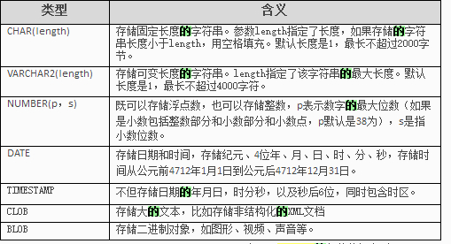

## oracle操作语句

#### 基础

```sql
--创建表
    create TB_student(m_time date,
            m_id varchar(32),
            m_age varchar(32),
            m_score varchar(32)
            );
--插入记录
    insert into TB_student(m_time,m_age)
        value(to_date('1996-10-10 00:00:00','YYYY-MM-DD HH24:MI:SS'), '15');--value的值要和表名后的字段对应
--备份表
    create bak_TB_student as select * from TB_student;
--清空表
    truncate table TB_student;
    delete TB_student
--删除表
    drop table TB_student;
--排序
    select * from TB_student order by m_age desc;
--根据日期进行删除
    delete from TB_student where m_time
        between to_date('1996-10-10 00:00:00','YYYY-MM-DD HH24:MI:SS')
        and to_date('2020-10-10 00:00:00','YYYY-MM-DD HH24:MI:SS')；
--添加字段
    alter table TB_student add(m_time);
 
--查找所有表名是以'TB'开头的，并且倒叙排序
SELECT table_name FROM user_tables
    WHERE table_name like 'TB%'     --%代表任意多个字符     _代表任意一个字符
    ORDER BY table_name DESC
 
--模糊查询like
select * from TB_student
    where m_name like 'xiaomin'
    and m_age like '%%'
    and m_birthday like TO_DATA(:l_data, 'YYYY-MM-DD')
```

#### 去重查询

```sql
select distinct m_time 
    from TB_student order by m_time desc;
--除去m_time和m_age全都一一样的数据
select distinct m_time,m_age 
    from TB_student order by m_time desc;
```

```sql
--去重查询：相同的m_age只显示m_id最大的那条记录
select * from TB_student
    where m_id in(select max(m_id) from TB_student group by m_age)

--显示每个年龄中生日最迟（最大）、并且性别为1的学生信息
select * from TB_student
    where m_birthday in
        (select max(m_birthday) from TB_student group by m_age)
    and m_sex = '1'
```

## 基本数据类型

