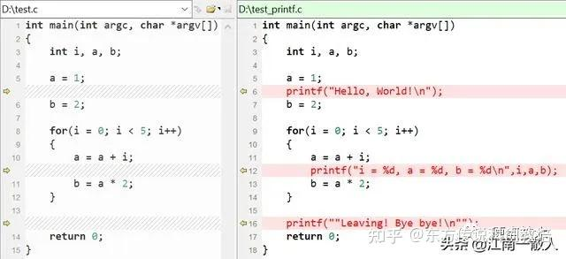

在Linux应用层软件开发中，GDB是强大的调试工具，用来调试C和 C++程序(也支持go等其他语言)。

GDB支持断点、单步执行、打印变量、观察变量、查看寄存器、查看堆栈等调试手段。

远端调试linux应用程序，可以使用gdbserver。在Linux内核层软件开发，有类似的KGDB。

我们正常使用gcc命令编译出来的可执行文件是无法通过gdb调试的，因为这样编译出来的可执行文件缺少gdb调试所需要的调试信息（比如每一行代码的行号、包含程序中所有符号的符号表等信息）。要想生成带有gdb调试信息的可执行文件，就要在gcc编译的时候添加 -g 选项。

常用命令
----

启动方式
----

使用gdb调试，一般有以下几种启动方式：

> gdb filename: 调试可执行程序  
> gdb attach pid: 通过”绑定“进程ID来调试正在运行的进程  
> gdb filename -c coredump\_file: 调试可执行文件

### 命令行

<table data-draft-node="block" data-draft-type="table" data-size="normal" data-row-style="normal"><tbody><tr><td>命令</td><td>作用</td></tr><tr><td>run arglist</td><td>以arglist为参数列表运行程序</td></tr><tr><td>set args arglist</td><td>指定启动命令行参数（启动之后 set args 设置参数）</td></tr><tr><td>set args</td><td>指定空的参数列表</td></tr><tr><td>show args</td><td>打印命令行列表</td></tr><tr><td># gdb --args ./sample_bin 参数</td><td>启动的时候带上参数</td></tr><tr><td># gdb ./sample_bin<br>(gdb) run 参数</td><td>启动之后 run 带上参数</td></tr></tbody></table>

### 断点

断点是我们在调试中经常用的一个功能，我们在指定位置设置断点之后，程序运行到该位置将会暂停，这个时候我们就可以对程序进行更多的操作，比如查看变量内容，堆栈情况等等，以帮助我们调试程序。

以设置断点的命令分为以下几类：

> breakpoint  
> watchpoint  
> catchpoint

### breakpoint

可以根据行号、函数、条件生成断点，下面是相关命令以及对应的作用说明：

<table data-draft-node="block" data-draft-type="table" data-size="normal" data-row-style="normal"><tbody><tr><td>命令</td><td>作用</td></tr><tr><td>break [file]:function</td><td>在文件file的function函数入口设置断点</td></tr><tr><td>break [file]:line</td><td>在文件file的第line行设置断点</td></tr><tr><td>info breakpoints</td><td>查看断点列表</td></tr><tr><td>info breakpoints num</td><td>查询 num 号断点的信息</td></tr><tr><td>break [+-]offset</td><td>在当前位置偏移量为[+-]offset处设置断点</td></tr><tr><td>break *addr</td><td>在地址addr处设置断点</td></tr><tr><td>break ... if expr</td><td>设置条件断点，仅仅在条件满足时</td></tr><tr><td>tbreak</td><td>命令的格式与用法与 break 相同，但是设置的断点只生效一次，该断点使用一次后自动去除。</td></tr><tr><td>rbreak</td><td>给函数加断点， rbreak regex 给所有满足表达式 REGEX 的函数加断点，设置的断点和 break 设置的断点一样。这个命令在C++调试的时候，用于给所有重载函数加断点非常方便。也可以加文件名来限制为哪个文件中的所有满足表达式的函数加断点 rbreak file.c:regex。</td></tr><tr><td>ignore n count</td><td>接下来对于编号为n的断点忽略count次</td></tr><tr><td>clear</td><td>删除所有断点</td></tr><tr><td>clear function</td><td>删除所有位于function内的断点</td></tr><tr><td>delete n</td><td>删除指定编号的断点，该编号可从info breakpoints的第一列获知</td></tr><tr><td>enable n</td><td>启用指定编号的断点</td></tr><tr><td>disable n</td><td>禁用指定编号的断点</td></tr><tr><td>save breakpoints file</td><td>保存断点信息到指定文件。可以把当前所设置的各种类型的断点信息全部保存在一个脚本文件中。这其中当然也包括dprintf设置的动态打印信息。</td></tr><tr><td>source file</td><td>导入文件中保存的断点信息</td></tr><tr><td>break</td><td>在下一个指令处设置断点</td></tr><tr><td>clear [file:]line</td><td>删除第line行的断点</td></tr></tbody></table>

### watchpoint

watchpoint是一种特殊类型的断点，类似于正常断点，是要求GDB暂停程序执行的命令。区别在于watchpoint没有驻留某一行源代码中，而是指示GDB每当某个表达式改变了值就暂停执行的命令。

watchpoint分为硬件实现和软件实现两种。前者需要硬件系统的支持；后者的原理就是每步执行后都检查变量的值是否改变。GDB在新建数据断点时会优先尝试硬件方式，如果失败再尝试软件实现。

<table data-draft-node="block" data-draft-type="table" data-size="normal" data-row-style="normal"><tbody><tr><td>命令</td><td>作用</td></tr><tr><td>watch variable</td><td>设置变量数据断点</td></tr><tr><td>watch var1 + var2</td><td>设置表达式数据断点</td></tr><tr><td>rwatch variable</td><td>设置读断点，仅支持硬件实现</td></tr><tr><td>awatch variable</td><td>设置读写断点，仅支持硬件实现</td></tr><tr><td>info watchpoints</td><td>查看数据断点列表</td></tr><tr><td>set can-use-hw-watchpoints 0</td><td>强制基于软件方式实现</td></tr></tbody></table>

使用数据断点时，需要注意：

> 当监控变量为局部变量时，一旦局部变量失效，数据断点也会失效  
> 如果监控的是指针变量p，则watch \*p监控的是p所指内存数据的变化情况，而watch p监控的是p指针本身有没有改变指向

最常见的数据断点应用场景：**「定位堆上的结构体内部成员何时被修改」**。由于指针一般为局部变量，为了解决断点失效，一般有两种方法。

<table data-draft-node="block" data-draft-type="table" data-size="normal" data-row-style="normal"><tbody><tr><td>命令</td><td>作用</td><td>备注</td></tr><tr><td>print &amp;variable</td><td>查看变量的内存地址</td><td>可简写为 p</td></tr><tr><td>watch *(type *)address</td><td>通过内存地址间接设置断点</td><td></td></tr><tr><td>watch -l variable</td><td>指定location参数</td><td></td></tr><tr><td>watch variable thread 1</td><td>仅编号为1的线程修改变量var值时会中断</td><td></td></tr><tr><td>p '文件名‘::局部全局变量</td><td>查看局部全局变量内存地址</td><td>文件名需带后缀，不需要路径，文件名需用单引号括住</td></tr><tr><td>display</td><td>查看某个变量或表达式的值</td><td>和 p 命令类似，但是 display 会一直跟踪这个变量或表达式值得变化，每执行一条语句都会打印一次变量或表达式的值。</td></tr><tr><td>info display</td><td>display 跟踪得变量或表达式也会放入一张表中，使用 info 命令可以查看信息</td><td>display 也可以按格式打印，语法和 print 一样，请参照上表（print）。</td></tr><tr><td>undisplay</td><td>后面加 Num 编号，取消跟踪。</td><td>也可以使用 del 删除。</td></tr></tbody></table>

注意：若上述 print 命令出现 <optimized out>， 可能是因为 -O2 编译选项优化导致。 将makefile 里的 CFLAGS += -O2改成 CFLAGS += -O0 重新编译再调试即可。

### catchpoint

从字面意思理解，是捕获断点，其主要监测信号的产生。例如c++的throw，或者加载库的时候，产生断点行为。

<table data-draft-node="block" data-draft-type="table" data-size="normal" data-row-style="normal"><tbody><tr><td>命令</td><td>含义</td></tr><tr><td>catch fork</td><td>程序调用fork时中断</td></tr><tr><td>tcatch fork</td><td>设置的断点只触发一次，之后被自动删除</td></tr><tr><td>catch syscall ptrace</td><td>为ptrace系统调用设置断点</td></tr></tbody></table>

❝在command命令后加断点编号，可以定义断点触发后想要执行的操作。在一些高级的自动化调试场景中可能会用到。❞

### 程序栈

<table data-draft-node="block" data-draft-type="table" data-size="normal" data-row-style="normal"><tbody><tr><td>命令</td><td>作用</td></tr><tr><td>backtrace [n]</td><td>打印栈帧</td></tr><tr><td>frame [n]</td><td>选择第n个栈帧，如果不存在，则打印当前栈帧</td></tr><tr><td>up n</td><td>选择当前栈帧编号+n的栈帧</td></tr><tr><td>down n</td><td>选择当前栈帧编号-n的栈帧</td></tr><tr><td>info frame [addr]</td><td>描述当前选择的栈帧</td></tr><tr><td>info args</td><td>当前栈帧的参数列表</td></tr><tr><td>info locals</td><td>当前栈帧的局部变量</td></tr><tr><td>f 0</td><td>切到 bt显示的最左列中的 #0 级函数</td></tr><tr><td>where</td><td>获取堆栈调用信息，包含程序中 的函数名称和相关参数值。</td></tr></tbody></table>

### 单步执行

<table data-draft-node="block" data-draft-type="table" data-size="normal" data-row-style="normal"><tbody><tr><td>命令</td><td>含义</td><td></td></tr><tr><td>next命令（可简写为n）</td><td>程序断住后，继续执行下一条语句</td><td></td></tr><tr><td>step命令（可简写为s）</td><td>单步跟踪到函数内部，但前提是该函数有调试信息并且有源码信息。</td><td>它还有一个选项，用来设置当遇到没有调试信息的函数，s命令是否跳过该函数，而执行后面的。默认情况下，它是会跳过的，即step-mode值是off</td></tr><tr><td>stepi（可简写为si）</td><td>它与step不同的是，每次执行一条机器指令</td><td></td></tr><tr><td>continue命令（可简写为c）或者fg</td><td>继续执行程序，直到再次遇到断点处</td><td></td></tr><tr><td>until命令（可简写为u）</td><td>thread hi继续运行到指定位置（临时断点）</td><td>假如我们在25行停住了，现在想要运行到29行停住，就可以使用until命令（可简写为u）：u 29</td></tr><tr><td>skip</td><td>跳过执行</td><td>可以在step时跳过一些不想关注的函数或者某个文件的代码（step也后面也可以跟文件）<br>其他相关命令：<br>l skip delete [num] 删除skip<br>l skip enable [num] 使能skip<br>l skip disable [num] 去使能skip</td></tr></tbody></table>

### 多进程、多线程

### 多进程

GDB在调试多进程程序（程序含fork调用）时，默认只追踪父进程。可以通过命令设置，实现只追踪父进程或子进程，或者同时调试父进程和子进程。

<table data-draft-node="block" data-draft-type="table" data-size="normal" data-row-style="normal"><tbody><tr><td>命令</td><td>作用</td><td>备注</td></tr><tr><td>info inferiors</td><td>查看进程列表</td><td></td></tr><tr><td>attach pid</td><td>绑定进程id</td><td>gdb attach 到某进程或线程</td></tr><tr><td>inferior num</td><td>切换到指定进程上进行调试</td><td></td></tr><tr><td>print $_exitcode</td><td>显示程序退出时的返回值</td><td></td></tr><tr><td>set follow-fork-mode child</td><td>追踪子进程</td><td></td></tr><tr><td>set follow-fork-mode parent</td><td>追踪父进程</td><td></td></tr><tr><td>show follow-fork-mode</td><td>查看调试进程模式是父进程还是子进程</td><td></td></tr><tr><td>set detach-on-fork on</td><td>fork调用时只追踪其中一个进程</td><td></td></tr><tr><td>set detach-on-fork off</td><td>fork调用时会同时追踪父子进程</td><td></td></tr><tr><td>info forks</td><td>打印DGB控制下的所有被fork出来的进程列表。该列表包括fork id、进程id和当前进程的位置</td><td></td></tr><tr><td>fork fork-id</td><td>使用fork命令从一个fork进程切换到另一个fork进程</td><td>参数fork-id是GDB分配的内部fork编号，该编号可用通过上面的命令info forks获取</td></tr></tbody></table>

在调试多进程程序时候，默认情况下，除了当前调试的进程，其他进程都处于挂起状态，所以，如果需要在调试当前进程的时候，其他进程也能正常执行，那么通过设置set schedule-multiple on即可。

### 多线程

多线程开发在日常开发工作中很常见，所以多线程的调试技巧非常有必要掌握。

默认调试多线程时，一旦程序中断，所有线程都将暂停。如果此时再继续执行当前线程，其他线程也会同时执行。

<table data-draft-node="block" data-draft-type="table" data-size="normal" data-row-style="normal"><tbody><tr><td>命令</td><td>作用</td></tr><tr><td>info threads</td><td>查看线程列表</td></tr><tr><td>thread num</td><td>切换到编号为 num 的线程</td></tr><tr><td>print $_thread</td><td>显示当前正在调试的线程编号</td></tr><tr><td>set scheduler-locking on</td><td>调试一个线程时，其他线程暂停执行</td></tr><tr><td>set scheduler-locking off</td><td>调试一个线程时，其他线程同步执行</td></tr><tr><td>set scheduler-locking step</td><td>仅用step调试线程时其他线程不执行，用其他命令如next调试时仍执行</td></tr><tr><td>thread apply all bt</td><td>打印当前进程的所有线程堆栈</td></tr></tbody></table>

如果只关心当前线程，建议临时设置 scheduler-locking 为 on，避免其他线程同时运行，导致命中其他断点分散注意力。

### 打印输出

通常情况下，在调试的过程中，我们需要查看某个变量的值，以分析其是否符合预期，这个时候就需要打印输出变量值。

<table data-draft-node="block" data-draft-type="table" data-size="normal" data-row-style="normal"><tbody><tr><td>命令</td><td>作用</td></tr><tr><td>whatis variable</td><td>查看变量的类型</td></tr><tr><td>ptype variable</td><td>查看变量详细的类型信息（例如结构体类型）</td></tr><tr><td>info variables var</td><td>查看定义该变量的文件，不支持局部变量</td></tr><tr><td>info registers</td><td>查看CPU寄存器</td></tr></tbody></table>

**打印字符串**

使用x/s命令打印ASCII字符串，如果是宽字符字符串，需要先看宽字符的长度 print sizeof(str)。

如果长度为2，则使用x/hs打印；如果长度为4，则使用x/ws打印。

<table data-draft-node="block" data-draft-type="table" data-size="normal" data-row-style="normal"><tbody><tr><td>命令</td><td>作用</td></tr><tr><td>x/s str</td><td>打印字符串</td></tr><tr><td>set print elements 0</td><td>打印不限制字符串长度/或不限制数组长度</td></tr><tr><td>call printf("%s\n",xxx)</td><td>这时打印出的字符串不会含有多余的转义符</td></tr><tr><td>printf "%s\n",xxx</td><td>同上</td></tr></tbody></table>

**打印数组**

<table data-draft-node="block" data-draft-type="table" data-size="normal" data-row-style="normal"><tbody><tr><td>命令</td><td>作用</td></tr><tr><td>print *array@10</td><td>打印从数组开头连续10个元素的值</td></tr><tr><td>print array[60]@10</td><td>打印array数组下标从60开始的10个元素，即第60~69个元素</td></tr><tr><td>set print array-indexes on</td><td>打印数组元素时，同时打印数组的下标</td></tr></tbody></table>

**打印指针**

<table data-draft-node="block" data-draft-type="table" data-size="normal" data-row-style="normal"><tbody><tr><td>命令</td><td>作用</td></tr><tr><td>print ptr</td><td>查看该指针指向的类型及指针地址</td></tr><tr><td>print *(struct xxx *)ptr</td><td>查看指向的结构体的内容</td></tr></tbody></table>

**打印指定内存地址的值**

使用x命令来打印内存的值，格式为x/nfu addr，以f格式打印从addr开始的n个长度单元为u的内存值。

> n：输出单元的个数  
> f：输出格式，如x表示以16进制输出，o表示以8进制输出，默认为x  
> u：一个单元的长度，b表示1个byte，h表示2个byte（half word），w表示4个byte，g表示8个byte（giant word）

<table data-draft-node="block" data-draft-type="table" data-size="normal" data-row-style="normal"><tbody><tr><td>命令</td><td>作用</td></tr><tr><td>x/8xb array</td><td>以16进制打印数组array的前8个byte的值</td></tr><tr><td>x/8xw array</td><td>以16进制打印数组array的前16个word的值</td></tr></tbody></table>

**打印局部变量**

<table data-draft-node="block" data-draft-type="table" data-size="normal" data-row-style="normal"><tbody><tr><td>命令</td><td>作用</td></tr><tr><td>info locals</td><td>打印当前函数局部变量的值</td></tr><tr><td>backtrace full</td><td>打印当前栈帧各个函数的局部变量值，命令可缩写为bt</td></tr><tr><td>bt full n</td><td>从内到外显示n个栈帧及其局部变量</td></tr><tr><td>bt full -n</td><td>从外向内显示n个栈帧及其局部变量</td></tr></tbody></table>

**打印结构体**

<table data-draft-node="block" data-draft-type="table" data-size="normal" data-row-style="normal"><tbody><tr><td>命令</td><td>作用</td><td>备注</td></tr><tr><td>set print pretty on</td><td>每行只显示结构体的一名成员</td><td>美化格式，整理打印格式</td></tr><tr><td>set print null-stop</td><td>不显示'\000' 这种</td><td></td></tr><tr><td>set max-value-size unlimited</td><td>取消结构体大小的限制</td><td>解决结构体太大问题</td></tr></tbody></table>

**还有其它一些set命令可以试试：**

set print address

set print address on

打开地址输出，当程序显示函数信息时，GDB会显出函数的参数地址。系统默认为打开的

set print object <on/off>

在C++中，如果一个对象指针指向其派生类，如果打开这个选项，GDB会自动按照虚方法调用的规则显示输出，如果关闭这个选项的话，GDB就不管虚函数表了。这个选项默认是off

show print pretty

查看GDB是如何显示结构体的

set print array

set print array on

打开数组显示，打开后当数组显示时，每个元素占一行，如果不打开的话，每个元素则以逗号分隔。这个选项默认是关闭的

set print null-stop <on/off>

如果打开了这个选项，那么当显示字符串时，遇到结束符则停止显示。这个选项默认为off

set print union <on/off>

设置显示结构体时，是否显式其内的联合体数据。例如有以下数据结构

**p string+n显示偏移n后的字符串内容**

  

l（list）查看代码，默认显示10行

> list 15 // 显示15行  
> list 30,36 // 显示30到36行  
> list test1.c:1,10 // 查看 test1.c 的代码1到10行  
> list fun：查看fun函数源代码  
> list file:fun：查看flie文件中的fun函数源代码

  

**dprintf动态打印**

命令dprintf，格式如下：

```
dprintf location,format string,arg1,arg2,...
```

dprintf命令和C语言中的printf的用法很相似，支持格式化打印。

相比printf函数，dprintf命令多了一个location参数，用于指定动态打印被触发的位置。

和break命令设置断点时一样，location可以是文件名:行号、函数名、或者具体的地址等。

除了location外，剩余的几个参数，就和printf()函数一致了。format指定字符串打印的格式，后面几个参数指定打印的数据来源。

以上面示例中的命令为例：

```
dprintf 6,"Hello, World!\n"
dprintf 11,"i = %d, a = %d, b = %d\n",i,a,b
dprintf 14,"Leaving! Bye bye!\n"
```

在功能上等价于下图中右侧的代码：



### 断点信息丢失怎么办？

在实际项目的调试过程中，难免会由于各种原因而必须要反复的调试才能定位出问题的原因，或者彻底理解程序的代码逻辑。

然而，dprintf本质上也是一种断点，因此，当调试结束后，本次调试时设置的断点信息就全部丢失了。如果要再次调试的话，就不得不重新设置一遍。

如果每次调试过程中，只需要设置一两个动态打印的话，那倒也简单。

可是，如果需要设置十几个甚至几十个动态打印呢？难道每次调试都要全部重新设置一遍吗？想想都是一件比较麻烦的事情，对吧？

其实，GDB也有对应的处理方案，很简单就可以解决！

保存和加载GDB断点信息
------------

为了解决上面提到的问题，GDB很贴心地提供了对断点信息保存和加载的功能。

GDB中，可以把当前所设置的各种类型的断点信息全部保存在一个脚本文件中。这其中当然也包括dprintf设置的动态打印信息。

只需要执行下面的命令即可：

```
save breakpoints file_name
```

这条命令会把当前所有的断点信息都保存在file\_name指定的文件中。

等下次进行调试时，可以把file\_name文件中的断点信息重新加载起来。有两种方法：

1.  启动GDB时使用“-x file\_name”参数。
2.  在GDB中执行source file\_name命令。

### 函数跳转

<table data-draft-node="block" data-draft-type="table" data-size="normal" data-row-style="normal"><tbody><tr><td>命令</td><td>作用</td></tr><tr><td>set step-mode on</td><td>不跳过不含调试信息的函数，可以显示和调试汇编代码</td></tr><tr><td>finish</td><td>执行完当前函数并打印返回值，然后触发中断</td></tr><tr><td>return 0</td><td>不再执行后面的指令，直接返回，可以指定返回值</td></tr><tr><td>call printf("%s\n", str)</td><td>调用printf函数，打印字符串(可以使用call或者print调用函数)</td></tr><tr><td>print func()</td><td>调用func函数(可以使用call或者print调用函数)</td></tr><tr><td>set var variable=xxx</td><td>设置变量variable的值为xxx</td></tr><tr><td>set {type}address = xxx</td><td>给存储地址为address，类型为type的变量赋值</td></tr><tr><td>info frame</td><td>显示函数堆栈的信息（堆栈帧地址、指令寄存器的值等）</td></tr></tbody></table>

### 反向调试

使用 target record-full 命令，可以在每个步骤中仔细记录程序的状态。

**在绝大多数环境下，在使用这些反向调试命令之前，必须要先通过record命令让GDB把程序执行过程中的所有状态信息全部记录下来。**

**通常是在程序运行起来之后，先设置断点让让程序停下来，然后输入record命令，开启状态信息记录，然后再继续执行。**相关常用命令有：

> \- record: 记录程序执行过程中所有状态信息  
> \- record stop: 停止记录状态信息  
> \- record goto: 让程序跳转到指定的位置, 如record goto start、record goto end、record goto n  
> \- record save filename: 把程序执行历史状态信息保存到文件，默认名字是gdb\_record.process\_id  
> \- record restore filename: 从历史记录文件中恢复状态信息  
> \- show record full insn-number-max：查看可以记录执行状态信息的最大指令个数，默认是200000  
> \- set record full insn-number-max limit：设置可以记录执行状态信息的最大指令个数  
> \- set record full insn-number-max unlimited：记录所有指令的执行状态信息

  

> \- reverse-next(rc): 参考next(n), 逆向执行一行代码，遇函数调用不进入，，**恢复到上一行代码刚执行完时的状态。**  
> \- reverse-nexti(rni): 参考nexti(ni), 逆向执行一条指令，遇函数调用不进入  
> \- reverse-step(rs): 参考step(s), 逆向执行一行代码，遇函数调用则进入  
> \- reverse-stepi(rsi): 参考setpi(si)， 逆向执行一条指令，遇函数调用则进入  
> \- reverse-continue(rc): 参考continue(c), 逆向继续执行，该状态将（现在）触发断点（或其他导致断点停止的状态）  
> \- reverse-finish: 参考finish，逆向执行，一直到函数入口处  
> \- reverse-search(): 参考search，逆向搜索  
> \- set exec-direction reverse: 设置程序逆向执行，执行完此命令后，所有常用命令如next, nexti, step, stepi, continue、finish等全部都变成逆向执行  
> \- set exec-direction forward: 设置程序正向执行，这也是默认的设置

### 其它

### 图形化

tui为terminal user interface的缩写，在启动时候指定-tui参数，或者调试时使用ctrl+x+a组合键，可进入或退出图形化界面。

<table data-draft-node="block" data-draft-type="table" data-size="normal" data-row-style="normal"><tbody><tr><td>命令</td><td>含义</td></tr><tr><td>layout src</td><td>显示源码窗口</td></tr><tr><td>layout asm</td><td>显示汇编窗口</td></tr><tr><td>layout split</td><td>显示源码 + 汇编窗口</td></tr><tr><td>layout regs</td><td>显示寄存器 + 源码或汇编窗口</td></tr><tr><td>winheight src +5</td><td>源码窗口高度增加5行</td></tr><tr><td>winheight asm -5</td><td>汇编窗口高度减小5行</td></tr><tr><td>winheight cmd +5</td><td>控制台窗口高度增加5行</td></tr><tr><td>winheight regs -5</td><td>寄存器窗口高度减小5行</td></tr></tbody></table>

### 汇编

<table data-draft-node="block" data-draft-type="table" data-size="normal" data-row-style="normal"><tbody><tr><td>命令</td><td>含义</td></tr><tr><td>disassemble function</td><td>查看函数的汇编代码</td></tr><tr><td>disassemble /mr function</td><td>同时比较函数源代码和汇编代码</td></tr></tbody></table>

### 调试和保存core文件

<table data-draft-node="block" data-draft-type="table" data-size="normal" data-row-style="normal"><tbody><tr><td>命令</td><td>含义</td></tr><tr><td>file exec_file *# *</td><td>加载可执行文件的符号表信息</td></tr><tr><td>core core_file</td><td>加载core-dump文件</td></tr><tr><td>gcore core_file</td><td>生成core-dump文件，记录当前进程的状态</td></tr></tbody></table>

设置GDB 支持将Ctrl+C的中断信号传给调试目标程序：

(gdb) handle SIGINT nostop print pass

SIGINT is used by the debugger.

Are you sure you want to change it? (y or n) y

(gdb) handle SIG32 nostopset print

(gdb) handle SIGABRT nostop

  

cat ~/.gbinit gdb会从这个文件读取配置

cat ~/.gdb\_history

  

**源代码路径映射**

set substitute-path from to 当被调试对象不是在本地编译出来的时候，用这个命令做一下源文件路径的映射。反向操作是unset substitute-path \[path\]

调试
--

### **可执行文件**

### **单线程**

首先，我们先看一段代码：

```
#include<stdio.h>
​
void print(int xx, int *xxptr) {
  printf("In print():\n");
  printf("   xx is %d and is stored at %p.\n", xx, &xx);
  printf("   ptr points to %p which holds %d.\n", xxptr, *xxptr);
}

int main(void) {
  int x = 10;
  int *ptr = &x;
  printf("In main():\n");
  printf("   x is %d and is stored at %p.\n", x, &x);
  printf("   ptr points to %p which holds %d.\n", ptr, *ptr);
  print(x, ptr);
  return 0;
}

```

这个代码比较简单，下面我们开始进入调试：

```
gdb ./test_main
GNU gdb (GDB) Red Hat Enterprise Linux 7.6.1-114.el7
Copyright (C) 2013 Free Software Foundation, Inc.
License GPLv3+: GNU GPL version 3 or later <http://gnu.org/licenses/gpl.html>
This is free software: you are free to change and redistribute it.
There is NO WARRANTY, to the extent permitted by law.  Type "show copying"
and "show warranty" for details.
This GDB was configured as "x86_64-redhat-linux-gnu".
For bug reporting instructions, please see:
<http://www.gnu.org/software/gdb/bugs/>...
Reading symbols from /root/test_main...done.
(gdb) r
Starting program: /root/./test_main
In main():
   x is 10 and is stored at 0x7fffffffe424.
   ptr points to 0x7fffffffe424 which holds 10.
In print():
   xx is 10 and is stored at 0x7fffffffe40c.
   xxptr points to 0x7fffffffe424 which holds 10.
[Inferior 1 (process 31518) exited normally]
Missing separate debuginfos, use: debuginfo-install glibc-2.17-260.el7.x86_64

```

在上述命令中，我们通过gdb test命令启动调试，然后通过执行r(run命令的缩写)执行程序，直至退出，**换句话说，上述命令是一个完整的使用gdb运行可执行程序的完整过程(只使用了r命令)**，接下来，我们将以此为例子，介绍几种比较常见的命令。

### **断点**

```
(gdb) b 15
Breakpoint 1 at 0x400601: file test_main.cc, line 15.
(gdb) info b
Num     Type           Disp Enb Address            What
1       breakpoint     keep y   0x0000000000400601 in main() at test_main.cc:15
(gdb) r
Starting program: /root/./test_main
In main():
   x is 10 and is stored at 0x7fffffffe424.
   ptr points to 0x7fffffffe424 which holds 10.

Breakpoint 1, main () at test_main.cc:15
15   print(xx, xxptr);
Missing separate debuginfos, use: debuginfo-install glibc-2.17-260.el7.x86_64
(gdb)

```

### **backtrace**

```
(gdb) backtrace
#0  main () at test_main.cc:15
(gdb)

```

backtrace命令是列出当前堆栈中的所有帧。在上面的例子中，栈上只有一帧，编号为0，属于main函数。

```
(gdb) step
print (xx=10, xxptr=0x7fffffffe424) at test_main.cc:4
4   printf("In print():\n");
(gdb)

```

接着，我们执行了step命令，即进入函数内。下面我们继续通过backtrace命令来查看栈帧信息。

```
(gdb) backtrace
#0  print (xx=10, xxptr=0x7fffffffe424) at test_main.cc:4
#1  0x0000000000400612 in main () at test_main.cc:15
(gdb)

```

从上面输出结果，我们能够看出，有两个栈帧，第1帧属于main函数，第0帧属于print函数。

每个栈帧都列出了该函数的参数列表。从上面我们可以看出，main函数没有参数，而print函数有参数，并且显示了其参数的值。

有一点我们可能比较迷惑，在第一次执行backtrace的时候，main函数所在的栈帧编号为0，而第二次执行的时候，main函数的栈帧为1，而print函数的栈帧为0，这是因为\_与栈的向下增长\_规律一致，我们只需要记住\_编号最小帧号就是最近一次调用的函数\_。

### **frame**

栈帧用来存储函数的变量值等信息，默认情况下，GDB总是位于当前正在执行函数对应栈帧的上下文中。

在前面的例子中，由于当前正在print()函数中执行，GDB位于第0帧的上下文中。**可以通过frame命令来获取当前正在执行的上下文所在的帧**。

```
(gdb) frame
#0  print (xx=10, xxptr=0x7fffffffe424) at test_main.cc:4
4   printf("In print():\n");
(gdb)

```

下面，我们尝试使用print命令打印下当前栈帧的值，如下：

```
(gdb) print xx
$1 = 10
(gdb) print xxptr
$2 = (int *) 0x7fffffffe424
(gdb)

```

如果我们想看其他栈帧的内容呢？比如main函数中x和ptr的信息呢？假如直接打印这俩值的话，那么就会得到如下：

```
(gdb) print x
No symbol "x" in current context.
(gdb) print xxptr
No symbol "ptr" in current context.
(gdb)

```

在此，我们可以通过\_frame num\_来切换栈帧，如下：

```
(gdb) frame 1
#1  0x0000000000400612 in main () at test_main.cc:15
15   print(x, ptr);
(gdb) print x
$3 = 10
(gdb) print ptr
$4 = (int *) 0x7fffffffe424
(gdb)

```

### **多线程**

为了方便进行演示，我们创建一个简单的例子，代码如下：

```
#include <chrono>
#include <iostream>
#include <string>
#include <thread>
#include <vector>

int fun_int(int n) {
  std::this_thread::sleep_for(std::chrono::seconds(10));
  std::cout << "in fun_int n = " << n << std::endl;
  
  return 0;
}

int fun_string(const std::string &s) {
  std::this_thread::sleep_for(std::chrono::seconds(10));
  std::cout << "in fun_string s = " << s << std::endl;
  
  return 0;
}

int main() {
  std::vector<int> v;
  v.emplace_back(1);
  v.emplace_back(2);
  v.emplace_back(3);

  std::cout << v.size() << std::endl;

  std::thread t1(fun_int, 1);
  std::thread t2(fun_string, "test");

  std::cout << "after thread create" << std::endl;
  t1.join();
  t2.join();
  return 0;
}

```

上述代码比较简单：

*   函数fun\_int的功能是休眠10s，然后打印其参数
*   函数fun\_string功能是休眠10s，然后打印其参数
*   main函数中，创建两个线程，分别执行上述两个函数

下面是一个完整的调试过程：

```
(gdb) b 27
Breakpoint 1 at 0x4013d5: file test.cc, line 27.
(gdb) b test.cc:32
Breakpoint 2 at 0x40142d: file test.cc, line 32.
(gdb) info b
Num     Type           Disp Enb Address            What
1       breakpoint     keep y   0x00000000004013d5 in main() at test.cc:27
2       breakpoint     keep y   0x000000000040142d in main() at test.cc:32
(gdb) r
Starting program: /root/test
[Thread debugging using libthread_db enabled]
Using host libthread_db library "/lib64/libthread_db.so.1".

Breakpoint 1, main () at test.cc:27
(gdb) c
Continuing.
3
[New Thread 0x7ffff6fd2700 (LWP 44996)]
in fun_int n = 1
[New Thread 0x7ffff67d1700 (LWP 44997)]

Breakpoint 2, main () at test.cc:32
32   std::cout << "after thread create" << std::endl;
(gdb) info threads
  Id   Target Id         Frame
  3    Thread 0x7ffff67d1700 (LWP 44997) "test" 0x00007ffff7051fc3 in new_heap () from /lib64/libc.so.6
  2    Thread 0x7ffff6fd2700 (LWP 44996) "test" 0x00007ffff7097e2d in nanosleep () from /lib64/libc.so.6
* 1    Thread 0x7ffff7fe7740 (LWP 44987) "test" main () at test.cc:32
(gdb) thread 2
[Switching to thread 2 (Thread 0x7ffff6fd2700 (LWP 44996))]
#0  0x00007ffff7097e2d in nanosleep () from /lib64/libc.so.6
(gdb) bt
#0  0x00007ffff7097e2d in nanosleep () from /lib64/libc.so.6
#1  0x00007ffff7097cc4 in sleep () from /lib64/libc.so.6
#2  0x00007ffff796ceb9 in std::this_thread::__sleep_for(std::chrono::duration<long, std::ratio<1l, 1l> >, std::chrono::duration<long, std::ratio<1l, 1000000000l> >) () from /lib64/libstdc++.so.6
#3  0x00000000004018cc in std::this_thread::sleep_for<long, std::ratio<1l, 1l> > (__rtime=...) at /usr/include/c++/4.8.2/thread:281
#4  0x0000000000401307 in fun_int (n=1) at test.cc:9
#5  0x0000000000404696 in std::_Bind_simple<int (*(int))(int)>::_M_invoke<0ul>(std::_Index_tuple<0ul>) (this=0x609080)
    at /usr/include/c++/4.8.2/functional:1732
#6  0x000000000040443d in std::_Bind_simple<int (*(int))(int)>::operator()() (this=0x609080) at /usr/include/c++/4.8.2/functional:1720
#7  0x000000000040436e in std::thread::_Impl<std::_Bind_simple<int (*(int))(int)> >::_M_run() (this=0x609068) at /usr/include/c++/4.8.2/thread:115
#8  0x00007ffff796d070 in ?? () from /lib64/libstdc++.so.6
#9  0x00007ffff7bc6dd5 in start_thread () from /lib64/libpthread.so.0
#10 0x00007ffff70d0ead in clone () from /lib64/libc.so.6
(gdb) c
Continuing.
after thread create
in fun_int n = 1
[Thread 0x7ffff6fd2700 (LWP 45234) exited]
in fun_string s = test
[Thread 0x7ffff67d1700 (LWP 45235) exited]
[Inferior 1 (process 45230) exited normally]
(gdb) q

```

在上述调试过程中：

1.  b 27 在第27行加上断点
2.  b [http://test.cc:32](https://link.zhihu.com/?target=http%3A//test.cc%3A32) 在第32行加上断点(效果与b 32一致)
3.  info b 输出所有的断点信息
4.  r 程序开始运行，并在第一个断点处暂停
5.  c 执行c命令，在第二个断点处暂停，在第一个断点和第二个断点之间，创建了两个线程t1和t2
6.  info threads 输出所有的线程信息，从输出上可以看出，总共有3个线程，分别为main线程、t1和t2
7.  thread 2 切换至线程2
8.  bt 输出线程2的堆栈信息
9.  c 直至程序结束
10.  q 退出gdb

### **多进程**

同上面一样，我们仍然以一个例子进行模拟多进程调试，代码如下：

```
#include <stdio.h>
#include <unistd.h>

int main()
{
    pid_t pid = fork();
    if (pid == -1) {
       perror("fork error\n");
       return -1;
    }
  
    if(pid == 0) { // 子进程
        int num = 1;
        while(num == 1){
          sleep(10);
         }
        printf("this is child,pid = %d\n", getpid());
    } else { // 父进程
        printf("this is parent,pid = %d\n", getpid());
      wait(NULL); // 等待子进程退出
    }
    return 0;
}

```

在上面代码中，包含两个进程，一个是父进程(也就是main进程)，另外一个是由fork()函数创建的子进程。

在默认情况下，在多进程程序中，GDB只调试main进程，也就是说无论程序调用了多少次fork()函数创建了多少个子进程，GDB在默认情况下，只调试父进程。为了支持多进程调试，从GDB版本7.0开始支持单独调试(调试父进程或者子进程)和同时调试多个进程。

那么，我们该如何调试子进程呢？我们可以使用如下几种方式进行子进程调试。

### **attach**

首先，无论是父进程还是子进程，都可以通过attach命令启动gdb进行调试。我们都知道，对于每个正在运行的程序，操作系统都会为其分配一个唯一ID号，也就是进程ID。如果我们知道了进程ID，就可以使用attach命令对其进行调试了。

在上面代码中，fork()函数创建的子进程内部，首先会进入while循环sleep，然后在while循环之后调用printf函数。这样做的目的有如下：

*   帮助attach捕获要调试的进程id
*   在使用gdb进行调试的时候，真正的代码(即print函数)没有被执行，这样就可以从头开始对子进程进行调试

> ❝可能会有疑惑，上面代码以及进入while循环，无论如何是不会执行到下面printf函数。其实，这就是gdb的厉害之处，可以通过gdb命令修改num的值，以便其跳出while循环  
> ❞

使用如下命令编译生成可执行文件test\_process

```
g++ -g test_process.cc -o test_process

```

现在，我们开始尝试启动调试。

```
gdb -q ./test_process
Reading symbols from /root/test_process...done.
(gdb)

```

这里需要说明下，之所以加-q选项，是想去掉其他不必要的输出，q为quite的缩写。

```
(gdb) r
Starting program: /root/./test_process
Detaching after fork from child process 37482.
this is parent,pid = 37478
[Inferior 1 (process 37478) exited normally]
Missing separate debuginfos, use: debuginfo-install glibc-2.17-260.el7.x86_64 libgcc-4.8.5-36.el7.x86_64 libstdc++-4.8.5-36.el7.x86_64
(gdb) attach 37482
//符号类输出，此处略去
(gdb) n
Single stepping until exit from function __nanosleep_nocancel,
which has no line number information.
0x00007ffff72b3cc4 in sleep () from /lib64/libc.so.6
(gdb)
Single stepping until exit from function sleep,
which has no line number information.
main () at test_process.cc:8
8       while(num==10){
(gdb)

```

在上述命令中，我们执行了n(next的缩写)，使其重新对while循环的判断体进行判断。

```
(gdb) set num = 1
(gdb) n
12       printf("this is child,pid = %d\n",getpid());
(gdb) c
Continuing.
this is child,pid = 37482
[Inferior 1 (process 37482) exited normally]
(gdb)

```

为了退出while循环，我们使用set命令设置了num的值为1，这样条件就会失效退出while循环，进而执行下面的printf()函数；在最后我们执行了c(continue的缩写)命令，支持程序退出。

> ❝如果程序正在正常运行，出现了死锁等现象，则可以通过ps获取进程ID，然后根据gdb attach pid进行绑定，进而查看堆栈信息  
> ❞

### **指定进程**

默认情况下，GDB调试多进程程序时候，只调试父进程。GDB提供了两个命令，可以通过follow-fork-mode和detach-on-fork来指定调试父进程还是子进程。

### **follow-fork-mode**

该命令的使用方式为：

```
(gdb) set follow-fork-mode mode

```

其中，mode有以下两个选项：

*   parent:父进程，mode的默认选项
*   child:子进程，其目的是告诉 gdb 在目标应用调用fork之后接着调试子进程而不是父进程，因为在Linux系统中fork()系统调用成功会返回两次，一次在父进程，一次在子进程

```
(gdb) show follow-fork-mode
Debugger response to a program call of fork or vfork is "parent".
(gdb) set follow-fork-mode child
(gdb) r
Starting program: /root/./test_process
[New process 37830]
this is parent,pid = 37826

^C
Program received signal SIGINT, Interrupt.
[Switching to process 37830]
0x00007ffff72b3e10 in __nanosleep_nocancel () from /lib64/libc.so.6
Missing separate debuginfos, use: debuginfo-install glibc-2.17-260.el7.x86_64 libgcc-4.8.5-36.el7.x86_64 libstdc++-4.8.5-36.el7.x86_64
(gdb) n
Single stepping until exit from function __nanosleep_nocancel,
which has no line number information.
0x00007ffff72b3cc4 in sleep () from /lib64/libc.so.6
(gdb) n
Single stepping until exit from function sleep,
which has no line number information.
main () at test_process.cc:8
8       while(num==10){
(gdb) show follow-fork-mode
Debugger response to a program call of fork or vfork is "child".
(gdb)

```

在上述命令中，我们做了如下操作：

1.  show follow-fork-mode:通过该命令来查看当前处于什么模式下，通过输出可以看出，处于parent即父进程模式
2.  set follow-fork-mode child:指定调试子进程模式
3.  r:运行程序，直接运行程序，此时会进入子进程，然后执行while循环
4.  ctrl + c:通过该命令，可以使得GDB收到SIGINT命令，从而暂停执行while循环
5.  n(next):继续执行，进而进入到while循环的条件判断处
6.  show follow-fork-mode:再次执行该命令，通过输出可以看出，当前处于child模式下

### **detach-on-fork**

如果一开始指定要调试子进程还是父进程，那么使用follow-fork-mode命令完全可以满足需求;但是如果想在调试过程中，想根据实际情况在父进程和子进程之间来回切换调试呢？

GDB提供了另外一个命令：

```
(gdb) set detach-on-fork mode

```

其中mode有如下两个值：

on:默认值，即表明只调试一个进程，可以是子进程，也可以是父进程

off:程序中的每个进程都会被记录，进而我们可以对所有的进程进行调试

如果选择关闭`detach-on-fork`模式(mode为off)，那么GDB将保留对所有被fork出来的进程控制，即可用调试所有被fork出来的进程。可用 使用`info forks`命令列出所有的可被GDB调试的fork进程，并可用使用fork命令从一个fork进程切换到另一个fork进程。

*   info forks: 打印DGB控制下的所有被fork出来的进程列表。该列表包括fork id、进程id和当前进程的位置
*   fork fork-id: 参数fork-id是GDB分配的内部fork编号，该编号可用通过上面的命令`info forks`获取

### coredump

当我们开发或者使用一个程序时候，最怕的莫过于程序莫名其妙崩溃。为了分析崩溃产生的原因，操作系统的内存内容（包括程序崩溃时候的堆栈等信息）会在程序崩溃的时候dump出来（默认情况下，这个文件名为core.pid，其中pid为进程id），这个dump操作叫做coredump(核心转储)，然后我们可以用调试器调试此文件，以还原程序崩溃时候的场景。

**配置**

配置coredump生成，有临时配置(退出终端后，配置失效)和永久配置两种。

**临时**

通过ulimit -a可以判断当前有没有配置coredump生成：

> ulimit -a  
> core file size (blocks, -c) 0  
> data seg size (kbytes, -d) unlimited  
> scheduling priority (-e) 0

从上面输出可以看出core file size后面的数为0，即不生成coredump文件，我们可以通过如下命令进行设置

> ulimit -c size

其中size为允许生成的coredump大小，这个一般尽量设置大点，以防止生成的coredump信息不全，笔者一般设置为不限。

> ulimit -c unlimited

需要说明的是，临时配置的coredump选项，其默认生成路径为执行该命令时候的路径，可以通过修改配置来进行路径修改。

**永久**

上面的设置只是使能了core dump功能，缺省情况下，内核在coredump时所产生的core文件放在与该程序相同的目录中，并且文件名固定为core。很显然，如果有多个程序产生core文件，或者同一个程序多次崩溃，就会重复覆盖同一个core文件。

过修改kernel的参数，可以指定内核所生成的coredump文件的文件名。使用下面命令，可以实现coredump永久配置、存放路径以及生成coredump名称等。

> /etc/profile  
> ulimit -c unlimited  
> /etc/security/limits.conf  
> \* soft core unlimited  
> echo "/tmp/coredump/core-%e-%p-%h-%t" > /proc/sys/kernel/core\_pattern

| core\_pattern参数 | 含义 |
| --- | --- |
| %p | 添加 pid |
| %u | 添加 uid |
| %g | 添加 gid |
| %s | 添加导致 core dump 的信号 |
| %t | 添加 core 生成的时间 |
| %h | 添加主机名 |
| %e | 添加命令名 |

GDB调试的原理
--------

gdb 通过系统调用 ptrace 来接管一个进程的执行。ptrace 系统调用提供了一种方法使得父进程可以观察和控制其它进程的执行，检查和改变其核心映像以及寄存器。它主要用来实现断点调试和系统调用跟踪。

ptrace系统调用定义如下：

```
#include <sys/ptrace.h>
long ptrace(enum __ptrace_request request, pid_t pid, void *addr, void *data)
```

l pid\_t pid：指示 ptrace 要跟踪的进程

l void \*addr：指示要监控的内存地址

l enum \_\_ptrace\_request request：决定了系统调用的功能，几个主要的选项：

*   PTRACE\_TRACEME：表示此进程将被父进程跟踪，任何信号（除了 SIGKILL）都会暂停子进程，接着阻塞于 wait() 等待的父进程被唤醒。子进程内部对 exec() 的调用将发出 SIGTRAP 信号，这可以让父进程在子进程新程序开始运行之前就完全控制它
*   PTRACE\_ATTACH：attach 到一个指定的进程，使其成为当前进程跟踪的子进程，而子进程的行为等同于它进行了一次 PTRACE\_TRACEME 操作。但需要注意的是，虽然当前进程成为被跟踪进程的父进程，但是子进程使用 getppid() 的到的仍将是其原始父进程的pid
*   PTRACE\_CONT：继续运行之前停止的子进程。可同时向子进程交付指定的信号

### 调试原理

### 运行并调试新进程

运行并调试新进程，步骤如下：

l 运行gdb exe

l 输入run命令，gdb执行以下操作：

*   通过fork()系统调用创建一个新进程
*   在新创建的子进程中执行ptrace(PTRACE\_TRACEME, 0, 0, 0)操作
*   在子进程中通过execv()系统调用加载指定的可执行文件

### attach运行的进程

可以通过gdb attach pid来调试一个运行的进程，gdb将对指定进程执行ptrace(PTRACE\_ATTACH, pid, 0, 0)操作。

需要注意的是，当我们attach一个进程id时候，可能会报如下错误：

> Attaching to process 28849  
> ptrace: Operation not permitted.

这是因为没有权限进行操作，可以根据启动该进程用户下或者root下进行操作。

### 断点原理

### 实现原理

当我们通过b或者break设置断点时候，就是在指定位置插入断点指令，当被调试的程序运行到断点的时候，产生SIGTRAP信号。该信号被gdb捕获并 进行断点命中判断。

### 设置原理

在程序中设置断点，就是先在该位置保存原指令，然后在该位置写入int 3。当执行到int 3时，发生软中断，内核会向子进程发送SIGTRAP信号。当然，这个信号会转发给父进程。然后用保存的指令替换int 3并等待操作恢复。

### 命中判断

gdb将所有断点位置存储在一个链表中。命中判定将被调试程序的当前停止位置与链表中的断点位置进行比较，以查看断点产生的信号。

### 条件判断

在断点处恢复指令后，增加了一个条件判断。如果表达式为真，则触发断点。由于需要判断一次，添加条件断点后，是否触发条件断点，都会影响性能。在 x86 平台上，部分硬件支持硬件断点。不是在条件断点处插入 int 3，而是插入另一条指令。当程序到达这个地址时，不是发出int 3信号，而是进行比较。特定寄存器的内容和某个地址，然后决定是否发送int 3。因此，当你的断点位置被程序频繁“通过”时，尽量使用硬件断点，这将有助于提高性能。

### **单步原理**

这个ptrace函数本身就支持，可以通过ptrace(PTRACE\_SINGLESTEP, pid,...)调用来实现单步。

```
printf("attaching to PID %d\n", pid);    
if (ptrace(PTRACE_ATTACH, pid, 0, 0) != 0)    
{        
    perror("attach failed");    
}    
int waitStat = 0;    
int waitRes = waitpid(pid, &waitStat, WUNTRACED);    
if (waitRes != pid || !WIFSTOPPED(waitStat))    
{        
    printf("unexpected waitpid result!\n");        
    exit(1);    
}       
int64_t numSteps = 0;    
while (true) 
{        
    auto res = ptrace(PTRACE_SINGLESTEP, pid, 0, 0);    
}
```

上述代码，首先接收一个pid，然后对其进行attach，最后调用ptrace进行单步调试。

结语
--

GDB 很强大，但并非万能，比如查内存泄露，调度性能等问题不行。

  

参考
--

[GDB调试-从入门实践到原理 (qq.com)](https://link.zhihu.com/?target=https%3A//mp.weixin.qq.com/s/XxPIfrQ3E0GR88UsmQNggg)

**[https://www.sourceware.org/gdb/documentation/](https://link.zhihu.com/?target=https%3A//www.sourceware.org/gdb/documentation/)**

  

本文转自 [https://zhuanlan.zhihu.com/p/694735179](https://zhuanlan.zhihu.com/p/694735179)，如有侵权，请联系删除。