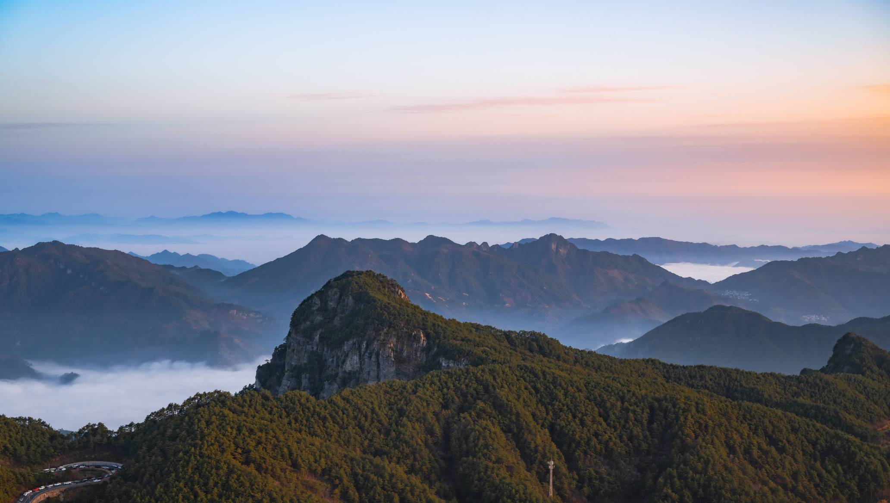
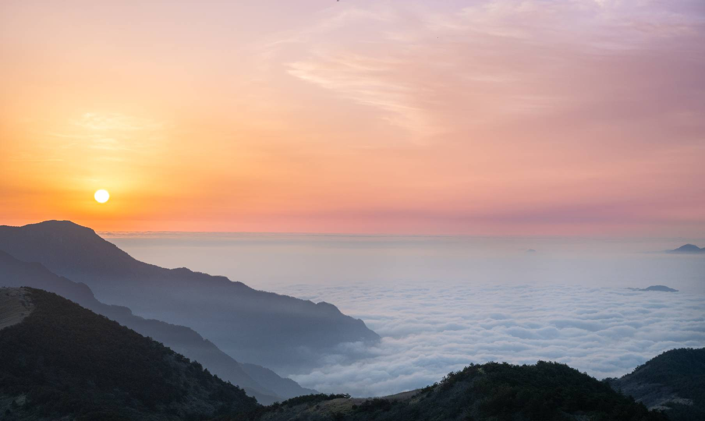

## 视频

  激流中国- NHK纪录片  
  动画：洛洛历险记  
  台剧：我们与恶的距离

---

## 文章English

[making friends on the internet](https://jon.bo/posts/making-friends-online/)  

[传奇谢幕：88岁MIT教授的最后一堂线性代数课](https://www.jiqizhixin.com/articles/2023-05-16-2)  

[You're not uncool. Making friends as an adult is just hard](https://www.wbur.org/hereandnow/2021/11/10/making-friends-adults)  

[Google "We Have No Moat, And Neither Does OpenAI"](https://www.semianalysis.com/p/google-we-have-no-moat-and-neither)

[Welcome to LLM University!](https://docs.cohere.com/docs/llmu)  

[making friends on the internet](https://jon.bo/posts/making-friends-online/)  

[AI's Hardware Problem](https://asianometry.substack.com/p/ais-hardware-problem)

[It’s Time For ‘Maximum Viable Product’ ](https://debugger.medium.com/its-time-for-maximum-viable-product-eec9d5211156)

## 徒步/旅游

麦理浩径

浪茄湾

## 南京

三桥湿地公园 （直接导航到大胜关防汛点）

  可生明火

无想寺水库

  可烧烤、钓鱼

皮库水库

  可钓鱼、无wc

## 皖南

### 太子尖

