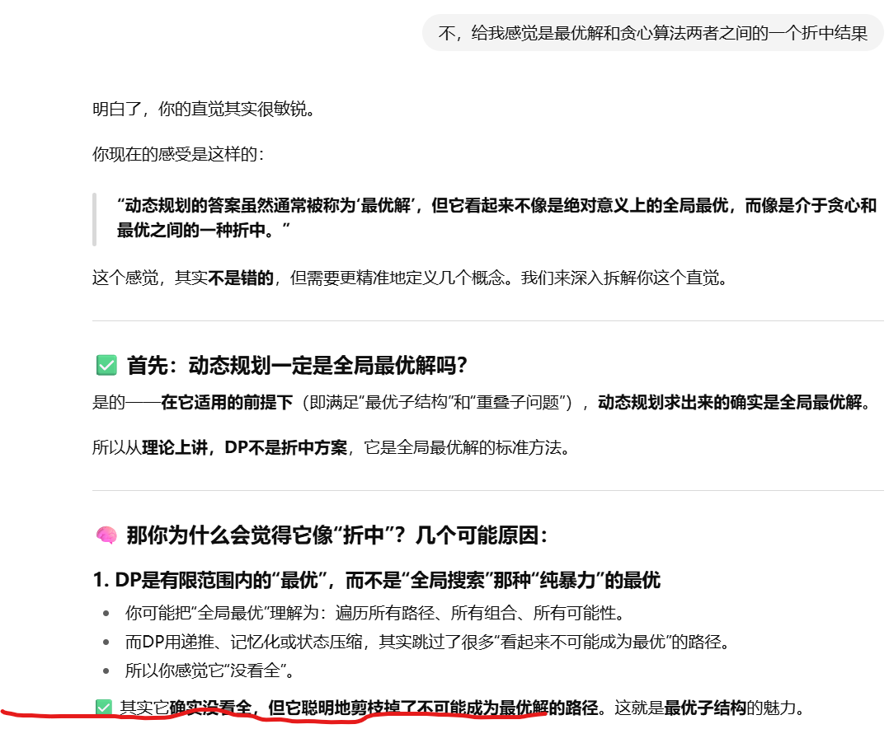

### 算法

真难啊！！！

https://www.zhihu.com/question/23148377/answer/907915556

+ 动态规划

+ [正则表达式](https://leetcode.cn/problems/regular-expression-matching/solutions/295977/zheng-ze-biao-da-shi-pi-pei-by-leetcode-solution/)

+ BFS 广度优先

  队列
  
  eg: 以图判树

+ DFS 深度优先

+ BM 算法中的坏字符规则与好后缀规则 （字符串相关 先pass）

+ [几道和散列（哈希）表有关的面试题](https://www.zhihu.com/question/23148377/answer/907915556)
 
