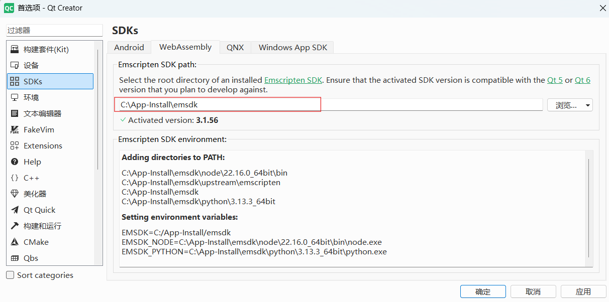

### 阮一峰

它没有版本控制。关于代码更改的唯一线索，是看它抛出的错误提示和代码注释，但是我学会了不要信任那些注释。


人工智能背后的实际技术，主要是一小部分巧妙的技巧，使用神经网络有效地对数据进行处理，神经网络本身并不神奇，并且开发过程很好理解，但是除非你有大钱购买硬件，并且使用每个人的私人数据进行训练，否则你的模型就没什么用。


不要将技术博客的写作视为打造"个人品牌"，它肯定对此有所帮助。但是，写作最重要的功能是，它是提升个人知识和批判性思维的一个工具。


---

家用的路由器实际上是<font color='red'>路由器</font>+<font color='red'>交换机</font>组成的。  
路由器对内连接的这些口，都属于交换机的部分，因为这些对内的口都是同一个网段的。交换机作为一个二层设备，当然能收到A发送给B的内容，因为这是交换机的功能。

---

https://github.com/krupkat/xpano

    一个自动拼接多张照片的工具。


---

[rang](https://github.com/agauniyal/rang)，控制台彩色输出库 headonly

---


```bash
# 使用 nmcli 命令扫描 WiFi 网络：
sudo nmcli dev wifi

# 连接到wifi
sudo nmcli dev wifi connect SSID password PASSWORD
```

---

[《operating-system-in-1000-lines》](https://github.com/nuta/operating-system-in-1000-lines)

[为什么-Windows-不像-Linux-可以混用-Debug-和-Release-库](https://blog.listenerri.com/archives/1f2e6d45-414a-44e7-bba3-7fae852e7def)

---

```cpp
# mac 上查看生成的库是什么平台
otool -l file | grep platform

1   mac
2   iphone
```

---
-DCMAKE_POSITION_INDEPENDENT_CODE=ON

---
watch -n 1 iw dev wlan0 link
iw dev wlan0 set power_save off


---
在线编辑文档模板
https://github.com/quick-bin/qbin

---

一次 mac 运行dump，添加编译选项 
  set(CMAKE_C_FLAGS "${CMAKE_C_FLAGS} -fsanitize=address")
  set(CMAKE_CXX_FLAGS "${CMAKE_CXX_FLAGS} -fsanitize=address")

---

cmake PRIVATE PUBLIC等权限


---

mac开发
  1. 参考已有的项目，写的plist等权限
  2. arm架构的mac运行正常，x86组网失败，定位了半天（看起来是网络权限问题）。想到之前写的smb client，在终端中运行，是没有问题呢。
  3. 在终端中运行，问题解决，emmm。直接双击.app文件中的可执行程序，同样功能无异常

  离谱：
    1. 不同架构（也许是不同系统）在权限的表现上不一样
    2. 可以链接互联网（登录成功），无法访问局域网设备（组网失败）

---
sudo apt install libspdlog-dev

~/ex$ cat spdlog_async.cpp
#include <spdlog/spdlog.h>
#include <spdlog/async.h>
#include <spdlog/sinks/basic_file_sink.h>
#include <chrono>
#include <thread>

int main() {
    const int msg_count = 10'000'000;

    // 线程池（队列大小，线程数）
    spdlog::init_thread_pool(8192, 1);

    auto file_sink = std::make_shared<spdlog::sinks::basic_file_sink_mt>("async_log.txt", true);
    auto async_logger = std::make_shared<spdlog::async_logger>(
        "async_logger", file_sink, spdlog::thread_pool(), spdlog::async_overflow_policy::block);

    spdlog::set_default_logger(async_logger);
    spdlog::set_pattern("[%H:%M:%S.%e] [%t] [%l] %v");

    auto start = std::chrono::steady_clock::now();

    for (int i = 0; i < msg_count; ++i) {
        spdlog::info("Test log message {}", i);
    }

    spdlog::shutdown(); // 等待 flush 完成

    auto end = std::chrono::steady_clock::now();
    auto duration_ns = std::chrono::duration_cast<std::chrono::nanoseconds>(end - start).count();
    double avg_ns = duration_ns * 1.0 / msg_count;

    fmt::print("Async mode:\n  Total time: {} ns\n  Avg time: {:.2f} ns/msg\n", duration_ns, avg_ns);
}

~/ex$ cat spdlog_sync.cpp
#include <spdlog/spdlog.h>
#include <spdlog/sinks/basic_file_sink.h>
#include <chrono>
#include <thread>

int main() {
    const int msg_count = 10'000'000;

    auto logger = spdlog::basic_logger_mt("sync_logger", "sync_log.txt", true);
    spdlog::set_default_logger(logger);
    spdlog::set_pattern("[%H:%M:%S.%e] [%t] [%l] %v");

    auto start = std::chrono::steady_clock::now();

    for (int i = 0; i < msg_count; ++i) {
        spdlog::info("Test log message {}", i);
    }

    auto end = std::chrono::steady_clock::now();
    auto duration_ns = std::chrono::duration_cast<std::chrono::nanoseconds>(end - start).count();
    double avg_ns = duration_ns * 1.0 / msg_count;

    fmt::print("Sync mode:\n  Total time: {} ns\n  Avg time: {:.2f} ns/msg\n", duration_ns, avg_ns);
}

---


---

git notes


---
std::mutex 无论什么地方，第二次加锁都会阻塞

std::recursive_mutex 在同一个线程，第二次加锁不会阻塞

```cpp
std::recursive_mutex mtx;

void safe_function() {
    mtx.lock();
    std::cout << "First lock acquired." << std::endl;

    mtx.lock();
    std::cout << "Second lock acquired safely (recursive_mutex)." << std::endl;

    mtx.unlock();
    mtx.unlock();
}
```

---
无需安装的解压压缩工具
https://www.7-zip.org/a/7z2500-extra.7z

查看文件夹被声明程序占用
https://lockhunter.com/assets/exe/lockhuntersetup_3-4-3.exe
---

2025.08.28 最近简直忙死
    项目中使用自研的rpc取代一个历史项目中的jsonrpccxx。  
    
    历史项目，如下数据可以正常解析 {"mic_id": "aaa", params: {"ip":"127.0.0.1", port: 100}}
            序列化到 Open(std::string mic_id, MicInfo params);

    自研rpc则不能解析
            struct {std::string mic_id, MicInfo params}
            最后，修改接口为Open(InputParams input);  收到上面的数据可以正常解析

    总结：自研项目，修改的有点不兼容开源版本， {} 无法反向序列化为 多个参数，[{},{}] 才可以反向序列化为多个参数
---


---

### Qt + WebAssembly 配置

参考 [链接](https://doc.qt.io/qt-6/wasm.html)

#### Windows

qt6.9 -> 3.1.70 （这个版本异常）  
qt6.8 -> 3.1.56

+ 配置emsdk

```bash
git clone https://github.com/emscripten-core/emsdk.git
cd emsdk
./emsdk install 3.1.56
./emsdk activate 3.1.56   
./emsdk_env.bat
```

+ 配置qt

> 我的qt是卸载后，重新安装并且选择了WebAssembly模块

首选项 -> SDKs ->WebAssembly 中修改root dir 为刚刚下载编译的路径。



然后，构建套件可用


在新建项目的时候，可以选择msvc、mingw或则webassembly了

Ctrl + R, 自动启动server，并且在浏览器中运行程序

---

路由器显示组播，导致(大型局域网)同局域网mdns无法发现。   （组播风暴）


---

```cpp

                if (task_queue_.empty()) {
                    // 让当前线程进入等待状态，直到被其他线程通知（notify_one 或 notify_all）或者虚假唤醒
                    //    虚假唤醒是指线程在没有收到notify通知的情况下被唤醒，虚假唤醒是多线程编程中常见的现象。
                    cv_.wait(lock);
                    continue;
                }

                auto now = std::chrono::steady_clock::now();
                auto &next_task = task_queue_.top();

                if (next_task.exec_time > now) {
                    // 等待超时，或者被notify_one唤醒
                    cv_.wait_until(lock, next_task.exec_time);
                    continue;
                }
```

---

### 压缩多媒体文件

压缩png/jpg -> jpg
convert 1102-5.png -resize 80% -strip -sampling-factor 4:2:0 -quality 40 1102-5.jpg

jpg->jpg
convert 1208-smile.JPG -resize 50% -quality 95 temp.
jpg

png->png  （聊天记录用着比较好）
 pngquant --quality=90-100 --speed=1 --strip --force 0520-1.png --output out0520-1.png

分割图片  除最后一个 每个图片的1688像素 
convert inpout.jpg -crop x1688 +repage out_%02d.jpg
x1688 裁切为上下几张图
1688x 裁切为左右几张图

裁切中间某部分图片 y坐标90开始，裁切掉高度为360的区域
convert 01.png -chop 0x360+0+90 result.png

压缩音频
ffmpeg -i input.m4a -c:a aac -b:a 64k output.m4a

---

```
编译的产物 支持x86和arm架构
set(CMAKE_OSX_ARCHITECTURES "x86_64;arm64")
```


[系统性的介绍C++11-26的资料 - github 英文](https://github.com/AnthonyCalandra/modern-cpp-features?tab=readme-ov-file)


---

查找大文件

```bash
find . -type f -size +10k -exec ls -lh {} \; | sort -k5 -r | awk '{print $5, $9}'

find . -type f -size +10k -exec stat --format="%s %n" {} \; | sort -n -r | awk '{print $1, $2}'

find . -type f -size +10k -exec stat --format="%s %n" {} \; | sort -n -r | awk '{size=$1; file=$2}
    {if (size >= 1048576) {print size/1048576 "M", file}
    else if (size >= 1024) {print size/1024 "K", file}
    else {print size "B", file}}'

```

---

### 下载bilibili视频

google 商店下载 Get cookies.txt插件

然后获取cookies.txt

```bash
# windows           pip install yt-dlp 
# ubuntu 20.04      sudo apt install yt-dlp
# 只需要视频链接的前半部分即可
yt-dlp --cookies .\www.bilibili.com_cookies.txt "https://www.bilibili.com/video/BV1zbCrBdEYA"
```

### 裁剪视频 音视频转文字

```bash
# 从00:10:30处，截取52s视频
ffmpeg -i input.mp4 -ss 00:10:30 -t 00:00:52 output_1.mp4

# 转文字
# --break-system-packages 并不会真的破坏系统
pip3 install --user openai-whisper --break-system-packages -i https://pypi.tuna.tsinghua.edu.cn/simple/ 
# 音视频文件 转文字
whisper output_1.mp4 --language zh  --output_format txt  --model base
```
